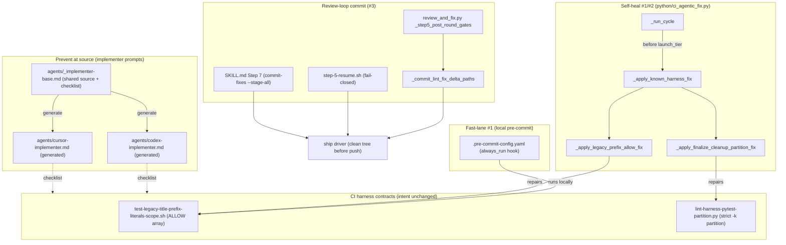

## Architecture Diagram

```mermaid
graph TD
    subgraph Prevent["Prevent at source (implementer prompts)"]
        BASE["agents/_implementer-base.md (shared source + checklist)"]
        CODEX["agents/codex-implementer.md (generated)"]
        CURSOR["agents/cursor-implementer.md (generated)"]
        BASE -->|generate| CODEX
        BASE -->|generate| CURSOR
    end

    subgraph Guards["CI harness contracts (intent unchanged)"]
        LEGACY["test-legacy-title-prefix-literals-scope.sh (ALLOW array)"]
        PART["lint-harness-pytest-partition.py (strict -k partition)"]
    end

    subgraph FastLane["Fast-lane #1 (local pre-commit)"]
        PRECOMMIT[".pre-commit-config.yaml (always_run hook)"]
    end

    subgraph SelfHeal["Self-heal #1/#2 (python/ci_agentic_fix.py)"]
        CYCLE["_run_cycle"]
        KNOWN["_apply_known_harness_fix"]
        ALLOWFIX["_apply_legacy_prefix_allow_fix"]
        PARTFIX["_apply_finalize_cleanup_partition_fix"]
        CYCLE -->|before launch_tier| KNOWN
        KNOWN --> ALLOWFIX
        KNOWN --> PARTFIX
    end

    subgraph ReviewLoop["Review-loop commit (#3)"]
        STEP5["review_and_fix.py _step5_post_round_gates"]
        COMMIT["_commit_lint_fix_delta_paths"]
        RESUME["step-5-resume.sh (fail-closed)"]
        STEP7["SKILL.md Step 7 (commit-fixes --stage-all)"]
        STEP5 --> COMMIT
    end

    SHIP["ship driver (clean tree before push)"]

    CODEX -.checklist.-> Guards
    CURSOR -.checklist.-> Guards
    PRECOMMIT -->|runs locally| LEGACY
    ALLOWFIX -->|repairs| LEGACY
    PARTFIX -->|repairs| PART
    COMMIT --> SHIP
    RESUME --> SHIP
    STEP7 --> SHIP
```
