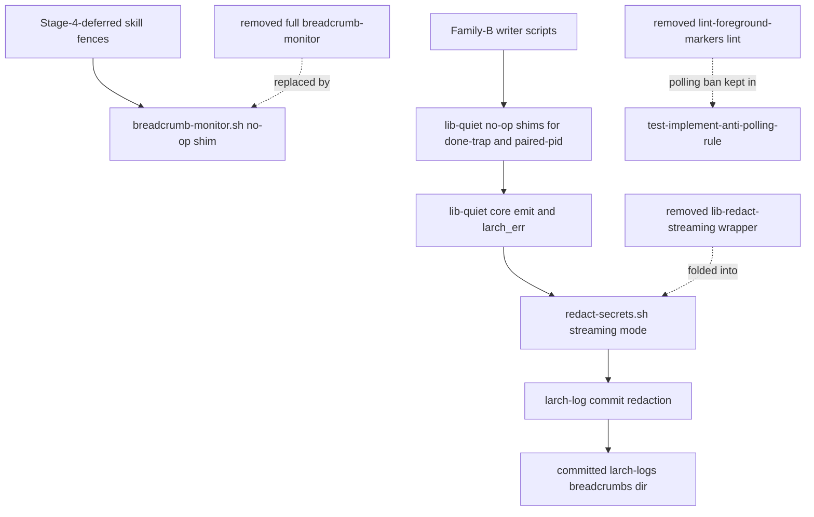

## Architecture Diagram

```mermaid
graph TD
    FENCES["Stage-4-deferred skill fences"] --> SHIM["breadcrumb-monitor.sh no-op shim"]
    WRITERS["Family-B writer scripts"] --> QSHIM["lib-quiet no-op shims for done-trap and paired-pid"]
    QSHIM --> QUIET["lib-quiet core emit and larch_err"]
    QUIET --> REDACT["redact-secrets.sh streaming mode"]
    REDACT --> LARCHLOG["larch-log commit redaction"]
    LARCHLOG --> FORENSICS["committed larch-logs breadcrumbs dir"]
    MON["removed full breadcrumb-monitor"] -.->|replaced by| SHIM
    REDS["removed lib-redact-streaming wrapper"] -.->|folded into| REDACT
    LINT["removed lint-foreground-markers lint"] -.->|polling ban kept in| POLLBAN["test-implement-anti-polling-rule"]
```
