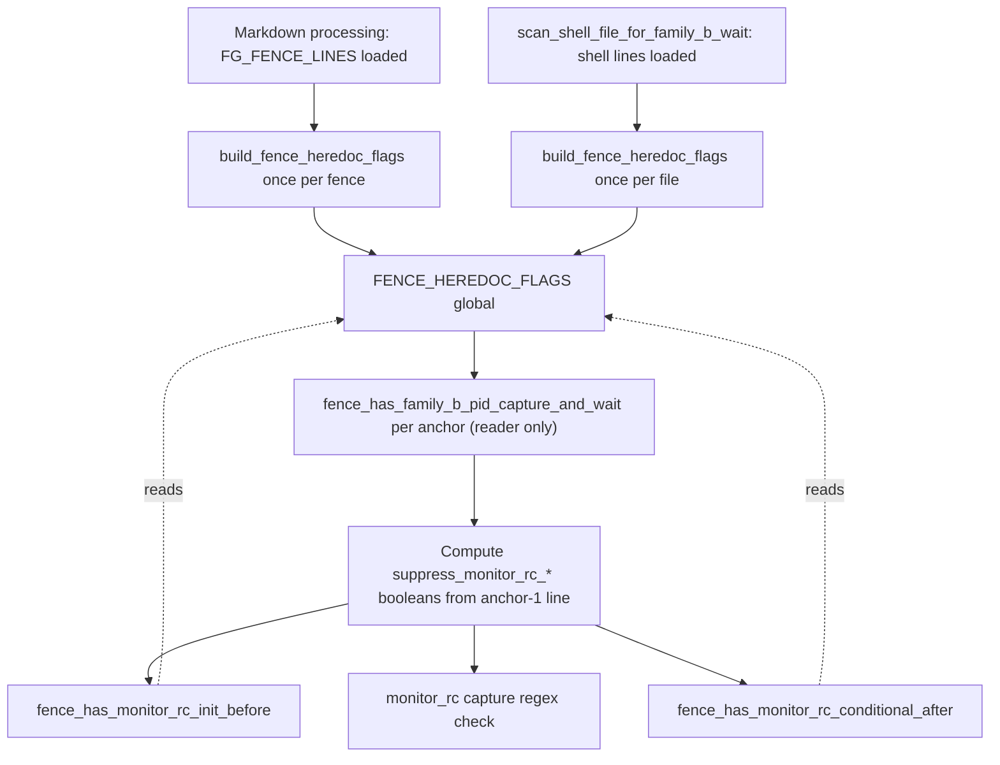

## Architecture Diagram

```mermaid
flowchart TD
    A["Markdown processing: FG_FENCE_LINES loaded"] --> B["build_fence_heredoc_flags once per fence"]
    C["scan_shell_file_for_family_b_wait: shell lines loaded"] --> D["build_fence_heredoc_flags once per file"]
    B --> E["FENCE_HEREDOC_FLAGS global"]
    D --> E
    E --> F["fence_has_family_b_pid_capture_and_wait per anchor (reader only)"]
    F --> G["Compute suppress_monitor_rc_* booleans from anchor-1 line"]
    G --> H["fence_has_monitor_rc_init_before"]
    G --> I["monitor_rc capture regex check"]
    G --> J["fence_has_monitor_rc_conditional_after"]
    H -.reads.-> E
    J -.reads.-> E
```
