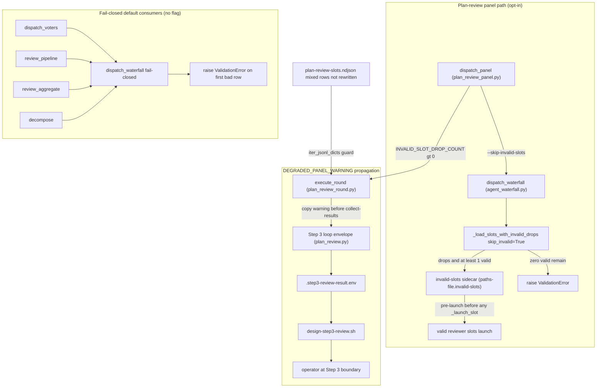

## Architecture Diagram

```mermaid
graph TD
    subgraph panel["Plan-review panel path (opt-in)"]
        DP["dispatch_panel (plan_review_panel.py)"]
        DW["dispatch_waterfall (agent_waterfall.py)"]
        LS["_load_slots_with_invalid_drops skip_invalid=True"]
        SIDE["invalid-slots sidecar (paths-file.invalid-slots)"]
        LAUNCH["valid reviewer slots launch"]
        FAIL1["raise ValidationError"]
    end

    subgraph faildefault["Fail-closed default consumers (no flag)"]
        VOTERS["dispatch_voters"]
        REVIEW["review_pipeline"]
        AGG["review_aggregate"]
        DECOMP["decompose"]
        DWDEF["dispatch_waterfall fail-closed"]
        FAIL2["raise ValidationError on first bad row"]
    end

    subgraph warnchain["DEGRADED_PANEL_WARNING propagation"]
        ROUND["execute_round (plan_review_round.py)"]
        LOOP["Step 3 loop envelope (plan_review.py)"]
        RESENV[".step3-review-result.env"]
        WRAP["design-step3-review.sh"]
        OP["operator at Step 3 boundary"]
    end

    MANIFEST["plan-review-slots.ndjson mixed rows not rewritten"]

    DP -->|"--skip-invalid-slots"| DW
    DW --> LS
    LS -->|"drops and at least 1 valid"| SIDE
    SIDE -->|"pre-launch before any _launch_slot"| LAUNCH
    LS -->|"zero valid remain"| FAIL1

    VOTERS --> DWDEF
    REVIEW --> DWDEF
    AGG --> DWDEF
    DECOMP --> DWDEF
    DWDEF --> FAIL2

    DP -->|"INVALID_SLOT_DROP_COUNT gt 0"| ROUND
    ROUND -->|"copy warning before collect-results"| LOOP
    LOOP --> RESENV
    RESENV --> WRAP
    WRAP --> OP

    MANIFEST -->|"iter_jsonl_dicts guard"| ROUND
```
