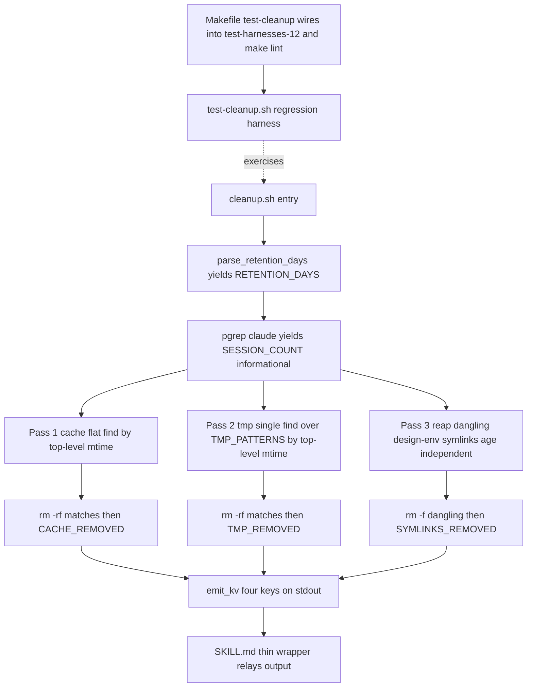

## Architecture Diagram

```mermaid
graph TD
    Entry[cleanup.sh entry]
    Ret[parse_retention_days yields RETENTION_DAYS]
    Sess[pgrep claude yields SESSION_COUNT informational]
    P1[Pass 1 cache flat find by top-level mtime]
    P1r[rm -rf matches then CACHE_REMOVED]
    P2[Pass 2 tmp single find over TMP_PATTERNS by top-level mtime]
    P2r[rm -rf matches then TMP_REMOVED]
    P3[Pass 3 reap dangling design-env symlinks age independent]
    P3r[rm -f dangling then SYMLINKS_REMOVED]
    Emit[emit_kv four keys on stdout]
    Skill[SKILL.md thin wrapper relays output]
    Mk[Makefile test-cleanup wires into test-harnesses-12 and make lint]
    Harness[test-cleanup.sh regression harness]

    Entry --> Ret --> Sess
    Sess --> P1 --> P1r --> Emit
    Sess --> P2 --> P2r --> Emit
    Sess --> P3 --> P3r --> Emit
    Emit --> Skill
    Mk --> Harness
    Harness -. exercises .-> Entry
```
