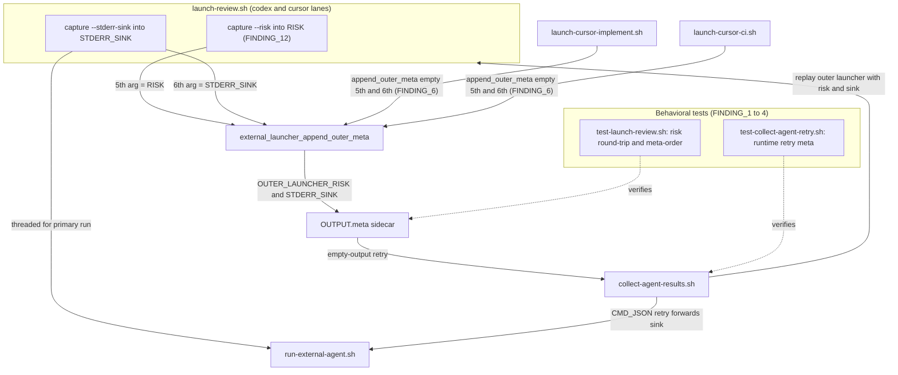

## Architecture Diagram

```mermaid
flowchart TD
    subgraph LAUNCH["launch-review.sh (codex and cursor lanes)"]
        RISK["capture --risk into RISK (FINDING_12)"]
        SINK["capture --stderr-sink into STDERR_SINK"]
    end

    RISK -->|"5th arg = RISK"| APPEND["external_launcher_append_outer_meta"]
    SINK -->|"6th arg = STDERR_SINK"| APPEND
    SINK -->|"threaded for primary run"| RXA["run-external-agent.sh"]
    APPEND -->|"OUTER_LAUNCHER_RISK and STDERR_SINK"| METAFILE["OUTPUT.meta sidecar"]

    METAFILE -->|"empty-output retry"| COLLECT["collect-agent-results.sh"]
    COLLECT -->|"replay outer launcher with risk and sink"| LAUNCH
    COLLECT -->|"CMD_JSON retry forwards sink"| RXA

    CIMPL["launch-cursor-implement.sh"] -->|"append_outer_meta empty 5th and 6th (FINDING_6)"| APPEND
    CCI["launch-cursor-ci.sh"] -->|"append_outer_meta empty 5th and 6th (FINDING_6)"| APPEND

    subgraph TESTS["Behavioral tests (FINDING_1 to 4)"]
        T1["test-launch-review.sh: risk round-trip and meta-order"]
        T2["test-collect-agent-retry.sh: runtime retry meta"]
    end
    T1 -.verifies.-> METAFILE
    T2 -.verifies.-> COLLECT
```
