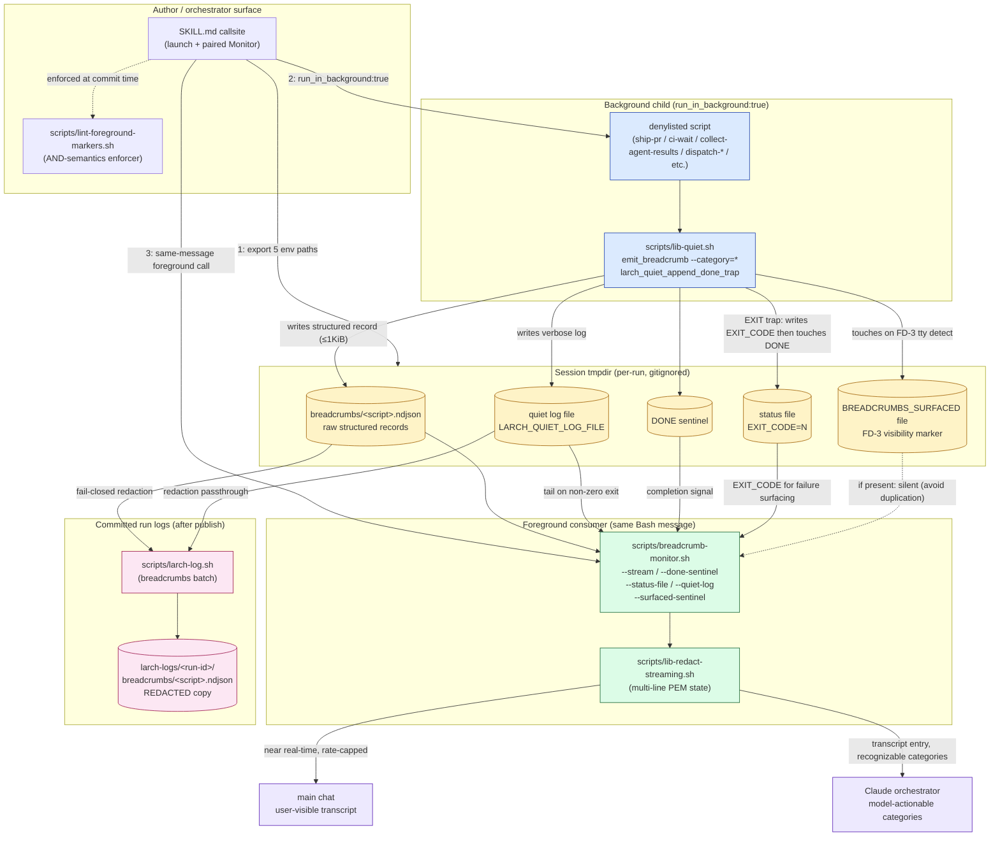

## Architecture Diagram

```mermaid
flowchart TB
    subgraph AuthorSurface["Author / orchestrator surface"]
        SKILL["SKILL.md callsite<br/>(launch + paired Monitor)"]
        LINT["scripts/lint-foreground-markers.sh<br/>(AND-semantics enforcer)"]
        SKILL -.->|enforced at commit time| LINT
    end

    subgraph SessionTmpdir["Session tmpdir (per-run, gitignored)"]
        STREAM[("breadcrumbs/&lt;script&gt;.ndjson<br/>raw structured records")]
        QLOG[("quiet log file<br/>LARCH_QUIET_LOG_FILE")]
        STATUS[("status file<br/>EXIT_CODE=N")]
        DONE[("DONE sentinel")]
        SURF[("BREADCRUMBS_SURFACED file<br/>FD-3 visibility marker")]
    end

    subgraph BgChild["Background child (run_in_background:true)"]
        CHILD["denylisted script<br/>(ship-pr / ci-wait / collect-agent-results / dispatch-* / etc.)"]
        LIBQ["scripts/lib-quiet.sh<br/>emit_breadcrumb --category=*<br/>larch_quiet_append_done_trap"]
        CHILD --> LIBQ
        LIBQ -- "writes structured record (≤1KiB)" --> STREAM
        LIBQ -- "writes verbose log" --> QLOG
        LIBQ -- "touches on FD-3 tty detect" --> SURF
        LIBQ -- "EXIT trap: writes EXIT_CODE then touches DONE" --> STATUS
        LIBQ -- " " --> DONE
    end

    subgraph FgConsumer["Foreground consumer (same Bash message)"]
        MON["scripts/breadcrumb-monitor.sh<br/>--stream / --done-sentinel<br/>--status-file / --quiet-log<br/>--surfaced-sentinel"]
        REDACT["scripts/lib-redact-streaming.sh<br/>(multi-line PEM state)"]
        MON --> REDACT
    end

    subgraph CommittedLogs["Committed run logs (after publish)"]
        LARCHLOG["scripts/larch-log.sh<br/>(breadcrumbs batch)"]
        COMMITTED[("larch-logs/&lt;run-id&gt;/<br/>breadcrumbs/&lt;script&gt;.ndjson<br/>REDACTED copy")]
        LARCHLOG --> COMMITTED
    end

    USER["main chat<br/>user-visible transcript"]
    MODEL["Claude orchestrator<br/>model-actionable categories"]

    SKILL -- "1: export 5 env paths" --> SessionTmpdir
    SKILL -- "2: run_in_background:true" --> CHILD
    SKILL -- "3: same-message foreground call" --> MON

    STREAM --> MON
    QLOG -- "tail on non-zero exit" --> MON
    DONE -- "completion signal" --> MON
    STATUS -- "EXIT_CODE for failure surfacing" --> MON
    SURF -. "if present: silent (avoid duplication)" .-> MON

    REDACT -- "near real-time, rate-capped" --> USER
    REDACT -- "transcript entry, recognizable categories" --> MODEL

    STREAM -- "fail-closed redaction" --> LARCHLOG
    QLOG -- "redaction passthrough" --> LARCHLOG

    classDef tmpdir fill:#fef3c7,stroke:#a16207
    classDef bg fill:#dbeafe,stroke:#1e40af
    classDef fg fill:#dcfce7,stroke:#166534
    classDef logs fill:#fce7f3,stroke:#9d174d
    classDef chat fill:#ede9fe,stroke:#5b21b6
    class STREAM,QLOG,STATUS,DONE,SURF tmpdir
    class CHILD,LIBQ bg
    class MON,REDACT fg
    class LARCHLOG,COMMITTED logs
    class USER,MODEL chat
```
