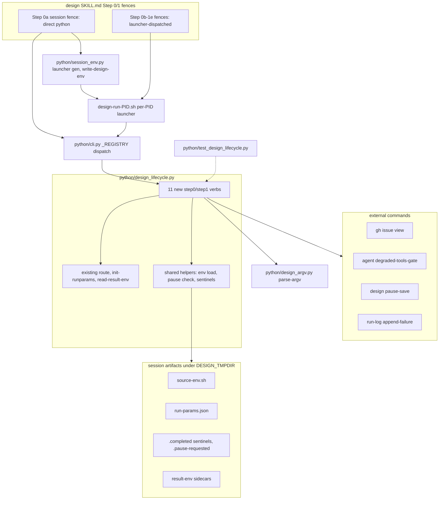

## Architecture Diagram

```mermaid
graph TD
  subgraph ORCH["design SKILL.md Step 0/1 fences"]
    PRE["Step 0a session fence: direct python"]
    POST["Step 0b-1e fences: launcher-dispatched"]
  end

  LAUNCH["design-run-PID.sh per-PID launcher"]
  CLI["python/cli.py _REGISTRY dispatch"]

  subgraph LIFE["python/design_lifecycle.py"]
    VERBS["11 new step0/step1 verbs"]
    LOW["existing route, init-runparams, read-result-env"]
    HELP["shared helpers: env load, pause check, sentinels"]
  end

  SENV["python/session_env.py launcher gen, write-design-env"]
  ARGV["python/design_argv.py parse-argv"]

  subgraph ART["session artifacts under DESIGN_TMPDIR"]
    SRC["source-env.sh"]
    RP["run-params.json"]
    SENT[".completed sentinels, .pause-requested"]
    RES["result-env sidecars"]
  end

  subgraph EXT["external commands"]
    GH["gh issue view"]
    GATE["agent degraded-tools-gate"]
    PAUSE["design pause-save"]
    RLOG["run-log append-failure"]
  end

  TST["python/test_design_lifecycle.py"]

  PRE --> CLI
  PRE --> SENV
  POST --> LAUNCH
  LAUNCH --> CLI
  SENV --> LAUNCH
  CLI --> VERBS
  VERBS --> LOW
  VERBS --> HELP
  VERBS --> ARGV
  HELP --> ART
  VERBS --> EXT
  TST -.-> VERBS
```
