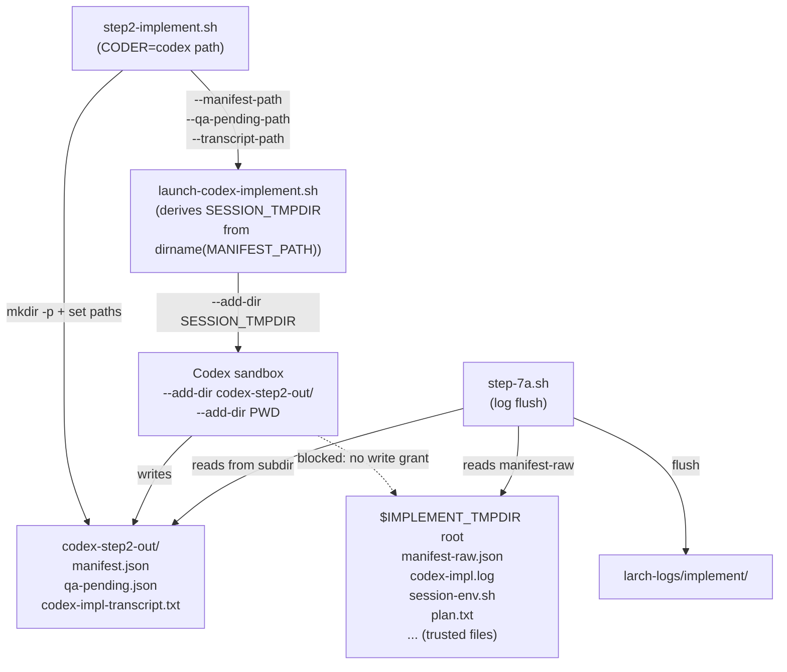

## Architecture Diagram

```mermaid
graph TD
    S2["step2-implement.sh\n(CODER=codex path)"]
    S2OUT["codex-step2-out/\nmanifest.json\nqa-pending.json\ncodex-impl-transcript.txt"]
    S2ROOT["$IMPLEMENT_TMPDIR root\nmanifest-raw.json\ncodex-impl.log\nsession-env.sh\nplan.txt\n... (trusted files)"]
    LAUNCHER["launch-codex-implement.sh\n(derives SESSION_TMPDIR\nfrom dirname(MANIFEST_PATH))"]
    CODEX["Codex sandbox\n--add-dir codex-step2-out/\n--add-dir PWD"]
    S7A["step-7a.sh\n(log flush)"]
    RUNLOG["larch-logs/implement/"]

    S2 -->|"mkdir -p + set paths"| S2OUT
    S2 -->|"--manifest-path\n--qa-pending-path\n--transcript-path"| LAUNCHER
    LAUNCHER -->|"--add-dir SESSION_TMPDIR"| CODEX
    CODEX -->|"writes"| S2OUT
    CODEX -.->|"blocked: no write grant"| S2ROOT
    S7A -->|"reads from subdir"| S2OUT
    S7A -->|"reads manifest-raw"| S2ROOT
    S7A -->|"flush"| RUNLOG
```
