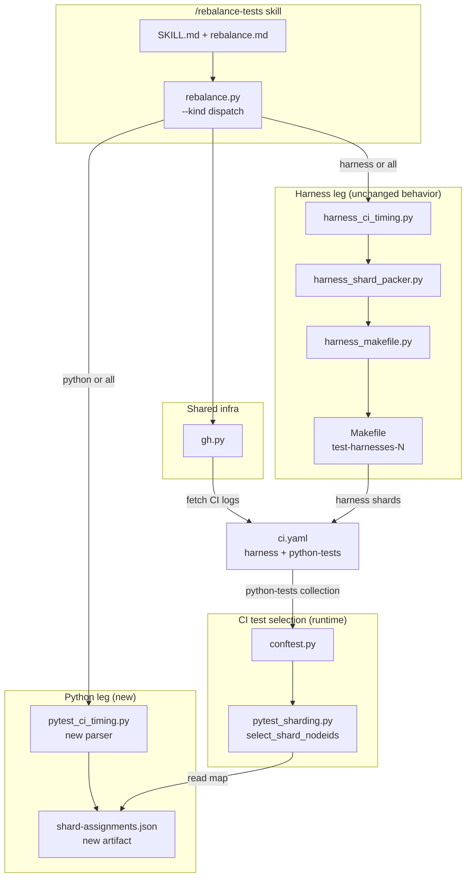

## Architecture Diagram

```mermaid
graph TD
    subgraph Skill["/rebalance-tests skill"]
        DOCS["SKILL.md + rebalance.md"]
        RUN["rebalance.py<br/>--kind dispatch"]
    end

    subgraph HarnessLeg["Harness leg (unchanged behavior)"]
        HCT["harness_ci_timing.py"]
        HSP["harness_shard_packer.py"]
        HMF["harness_makefile.py"]
        MAKEFILE["Makefile<br/>test-harnesses-N"]
    end

    subgraph PythonLeg["Python leg (new)"]
        PCT["pytest_ci_timing.py<br/>new parser"]
        ASSIGN["shard-assignments.json<br/>new artifact"]
    end

    subgraph Shared["Shared infra"]
        GH["gh.py"]
    end

    subgraph Consumer["CI test selection (runtime)"]
        CONF["conftest.py"]
        SHARD["pytest_sharding.py<br/>select_shard_nodeids"]
    end

    CI["ci.yaml<br/>harness + python-tests"]

    DOCS --> RUN
    RUN -->|harness or all| HCT
    RUN -->|python or all| PCT
    RUN --> GH
    HCT --> HSP
    HSP --> HMF
    HMF --> MAKEFILE
    PCT --> ASSIGN
    GH -->|fetch CI logs| CI
    CI -->|python-tests collection| CONF
    CONF --> SHARD
    SHARD -->|read map| ASSIGN
    MAKEFILE -->|harness shards| CI
```
