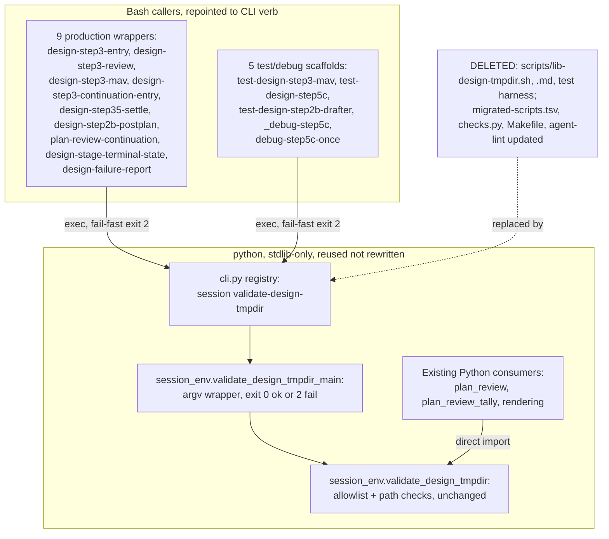

## Architecture Diagram

```mermaid
graph TD
    subgraph Bash["Bash callers, repointed to CLI verb"]
        PROD["9 production wrappers:<br/>design-step3-entry, design-step3-review,<br/>design-step3-mav, design-step3-continuation-entry,<br/>design-step35-settle, design-step2b-postplan,<br/>plan-review-continuation, design-stage-terminal-state,<br/>design-failure-report"]
        TEST["5 test/debug scaffolds:<br/>test-design-step3-mav, test-design-step5c,<br/>test-design-step2b-drafter, _debug-step5c,<br/>debug-step5c-once"]
    end

    subgraph Python["python, stdlib-only, reused not rewritten"]
        CLI["cli.py registry:<br/>session validate-design-tmpdir"]
        MAIN["session_env.validate_design_tmpdir_main:<br/>argv wrapper, exit 0 ok or 2 fail"]
        CORE["session_env.validate_design_tmpdir:<br/>allowlist + path checks, unchanged"]
        PYCONS["Existing Python consumers:<br/>plan_review, plan_review_tally, rendering"]
    end

    DEAD["DELETED: scripts/lib-design-tmpdir.sh, .md, test harness;<br/>migrated-scripts.tsv, checks.py, Makefile, agent-lint updated"]

    PROD -->|exec, fail-fast exit 2| CLI
    TEST -->|exec, fail-fast exit 2| CLI
    CLI --> MAIN
    MAIN --> CORE
    PYCONS -->|direct import| CORE
    DEAD -. replaced by .-> CLI
```
