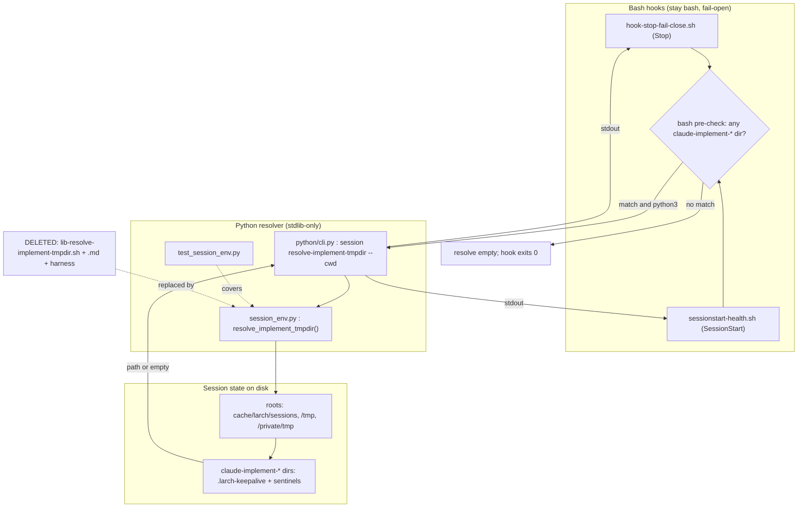

## Architecture Diagram

```mermaid
graph TD
    subgraph hooks["Bash hooks (stay bash, fail-open)"]
        stop["hook-stop-fail-close.sh (Stop)"]
        sess["sessionstart-health.sh (SessionStart)"]
        gate{"bash pre-check: any claude-implement-* dir?"}
    end

    subgraph py["Python resolver (stdlib-only)"]
        cli["python/cli.py : session resolve-implement-tmpdir --cwd"]
        resolver["session_env.py : resolve_implement_tmpdir()"]
        tests["test_session_env.py"]
    end

    subgraph disk["Session state on disk"]
        roots["roots: cache/larch/sessions, /tmp, /private/tmp"]
        cand["claude-implement-* dirs: .larch-keepalive + sentinels"]
    end

    deleted["DELETED: lib-resolve-implement-tmpdir.sh + .md + harness"]

    stop --> gate
    sess --> gate
    gate -->|no match| skip["resolve empty; hook exits 0"]
    gate -->|match and python3| cli
    cli --> resolver
    resolver --> roots
    roots --> cand
    cand -->|path or empty| cli
    cli -->|stdout| stop
    cli -->|stdout| sess
    tests -.->|covers| resolver
    deleted -.->|replaced by| resolver
```
