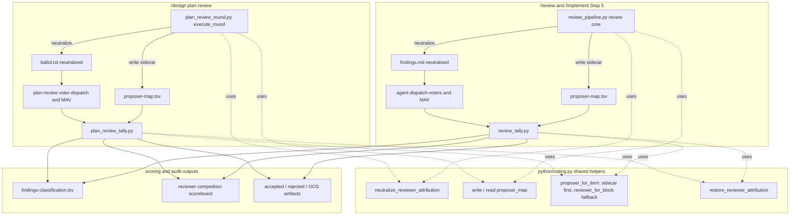

## Architecture Diagram

```mermaid
graph TD
    subgraph shared["python/voting.py shared helpers"]
        NEUT["neutralize_reviewer_attribution"]
        PMAP["write / read proposer_map"]
        PFOR["proposer_for_item: sidecar first, reviewer_for_block fallback"]
        REST["restore_reviewer_attribution"]
    end

    subgraph design["/design plan review"]
        PRR["plan_review_round.py execute_round"]
        PMD["proposer-map.tsv"]
        BALLOT["ballot.txt neutralized"]
        PVD["plan-review voter-dispatch and MAV"]
        PRT["plan_review_tally.py"]
    end

    subgraph code["/review and /implement Step 5"]
        RP["review_pipeline.py review core"]
        PMR["proposer-map.tsv"]
        FIND["findings.md neutralized"]
        DV["agent dispatch-voters and MAV"]
        RT["review_tally.py"]
    end

    subgraph out["scoring and audit outputs"]
        CLS["findings-classification.tsv"]
        SCORE["reviewer competition scoreboard"]
        ART["accepted / rejected / OOS artifacts"]
    end

    PRR -->|write sidecar| PMD
    PRR -->|neutralize| BALLOT
    BALLOT --> PVD
    PVD --> PRT
    PMD --> PRT

    RP -->|write sidecar| PMR
    RP -->|neutralize| FIND
    FIND --> DV
    DV --> RT
    PMR --> RT

    PRR -.uses.-> NEUT
    PRR -.uses.-> PMAP
    RP -.uses.-> NEUT
    RP -.uses.-> PMAP
    PRT -.uses.-> PFOR
    PRT -.uses.-> REST
    RT -.uses.-> PFOR
    RT -.uses.-> REST

    PRT --> CLS
    PRT --> SCORE
    PRT --> ART
    RT --> CLS
    RT --> SCORE
    RT --> ART
```
