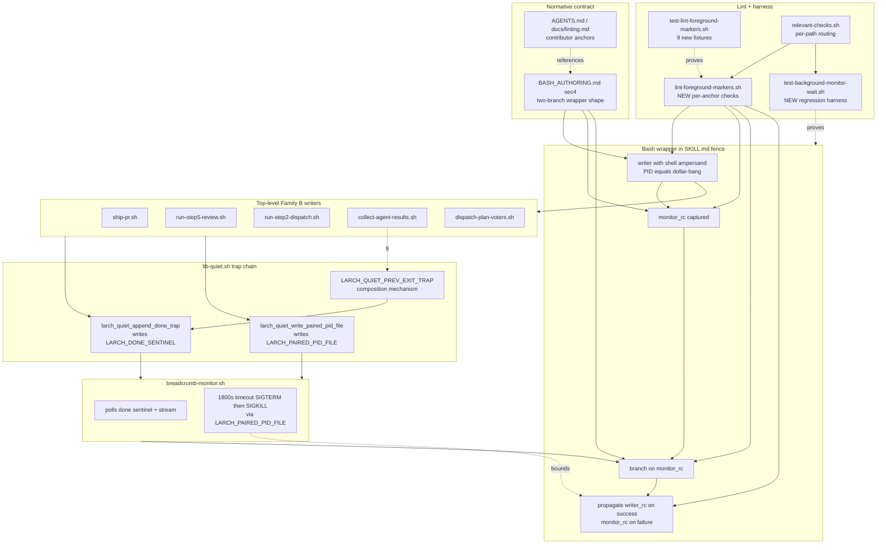

## Architecture Diagram

```mermaid
flowchart TB
  subgraph Contract["Normative contract"]
    BA4["BASH_AUTHORING.md sec4<br/>two-branch wrapper shape"]
    DOC["AGENTS.md / docs/linting.md<br/>contributor anchors"]
  end

  subgraph Wrapper["Bash wrapper in SKILL.md fence"]
    AMP["writer with shell ampersand<br/>PID equals dollar-bang"]
    MR["monitor_rc captured"]
    BR["branch on monitor_rc"]
    PROP["propagate writer_rc on success<br/>monitor_rc on failure"]
  end

  subgraph FamilyB["Top-level Family B writers"]
    SHIP["ship-pr.sh"]
    R5["run-step5-review.sh"]
    R2["run-step2-dispatch.sh"]
    COL["collect-agent-results.sh"]
    DPV["dispatch-plan-voters.sh"]
  end

  subgraph LibQuiet["lib-quiet.sh trap chain"]
    DT["larch_quiet_append_done_trap<br/>writes LARCH_DONE_SENTINEL"]
    PPF["larch_quiet_write_paired_pid_file<br/>writes LARCH_PAIRED_PID_FILE"]
    PREV["LARCH_QUIET_PREV_EXIT_TRAP<br/>composition mechanism"]
  end

  subgraph Monitor["breadcrumb-monitor.sh"]
    POLL["polls done sentinel + stream"]
    KILL["1800s timeout SIGTERM then SIGKILL<br/>via LARCH_PAIRED_PID_FILE"]
  end

  subgraph Enforcement["Lint + harness"]
    LINT["lint-foreground-markers.sh<br/>NEW per-anchor checks"]
    HARN["test-background-monitor-wait.sh<br/>NEW regression harness"]
    LINTTEST["test-lint-foreground-markers.sh<br/>9 new fixtures"]
    RC["relevant-checks.sh<br/>per-path routing"]
  end

  AMP --> FamilyB
  AMP --> MR
  MR --> BR
  BR --> PROP

  FamilyB --> DT
  FamilyB --> PPF
  DT --> Monitor
  PPF --> Monitor

  COL -.fix.-> PREV
  PREV --> DT

  Monitor --> BR
  KILL -.bounds.-> PROP

  BA4 --> AMP
  BA4 --> MR
  BA4 --> BR

  LINT --> AMP
  LINT --> MR
  LINT --> BR
  LINT --> PROP

  HARN -.proves.-> Wrapper
  LINTTEST -.proves.-> LINT
  RC --> LINT
  RC --> HARN
  DOC -.references.-> BA4
```
