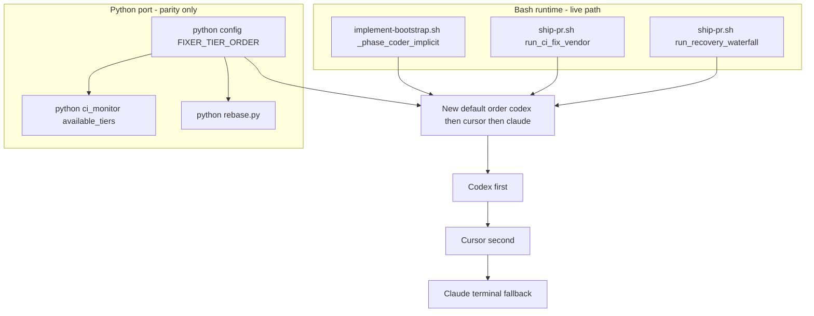

## Architecture Diagram

```mermaid
flowchart TD
    subgraph Bash [Bash runtime - live path]
        coder[implement-bootstrap.sh _phase_coder_implicit]
        cifix[ship-pr.sh run_ci_fix_vendor]
        merge[ship-pr.sh run_recovery_waterfall]
    end
    subgraph Py [Python port - parity only]
        cfg[python config FIXER_TIER_ORDER]
        cimon[python ci_monitor available_tiers]
        reb[python rebase.py]
    end
    order[New default order codex then cursor then claude]
    codex[Codex first]
    cursor[Cursor second]
    claude[Claude terminal fallback]

    coder --> order
    cifix --> order
    merge --> order
    cfg --> cimon
    cfg --> reb
    cfg --> order
    order --> codex
    codex --> cursor
    cursor --> claude
```
