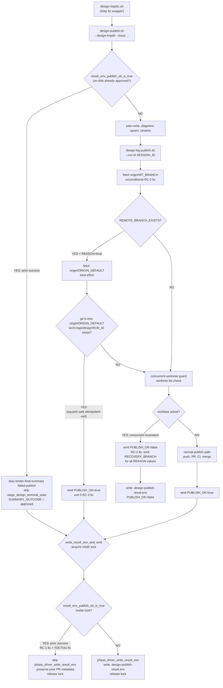

## Architecture Diagram

```mermaid
flowchart TD
    A["design-step5c.sh\n(Step 5c wrapper)"] --> B["design-publish.sh\n--design-tmpdir --issue ..."]

    B --> C{"result_env_publish_ok_is_true\n(on disk already approved?)"}
    C -- "YES: prior success" --> D["skip render-final-summary failed-publish\nskip stage_design_terminal_state\nSUMMARY_OUTCOME = approved"]
    C -- "NO" --> E["plan-write, diagrams upsert, rename"]

    E --> F["design-log-publish.sh\n--run-id SESSION_ID"]

    F --> G["fetch origin/WT_BRANCH\nunconditional RC-2 fix"]
    G --> H{"REMOTE_BRANCH_EXISTS?"}
    H -- "YES + REASON=final" --> I["fetch origin/ORIGIN_DEFAULT\nbest-effort"]
    I --> J{"git ls-tree origin/ORIGIN_DEFAULT\nlarch-logs/design/RUN_ID exists?"}
    J -- "YES\n(squash-safe idempotent exit)" --> K["emit PUBLISH_OK=true\nexit 0 RC-3 fix"]
    H -- "NO" --> L["concurrent-worktree guard\nworktree list check"]
    J -- "NO" --> L

    L --> M{"worktree active?"}
    M -- "YES: concurrent invocation" --> N["emit PUBLISH_OK=false\nRC-2 fix: emit RECOVERY_BRANCH\nfor all REASON values"]
    M -- "NO" --> O["normal publish path\npush, PR, CI, merge"]
    O --> P["emit PUBLISH_OK=true"]

    P --> Q{"write_result_env_and_emit\nacquire mkdir lock"}
    N --> Q_false["write .design-publish-result.env\nPUBLISH_OK=false"]

    Q --> R{"result_env_publish_ok_is_true\ninside lock?"}
    R -- "YES: prior success\nRC-1 fix + TOCTOU fix" --> S["skip phase_driver_write_result_env\npreserve prior PR metadata\nrelease lock"]
    R -- "NO" --> T["phase_driver_write_result_env\nwrite .design-publish-result.env\nrelease lock"]

    D --> Q
    K --> Q
```
