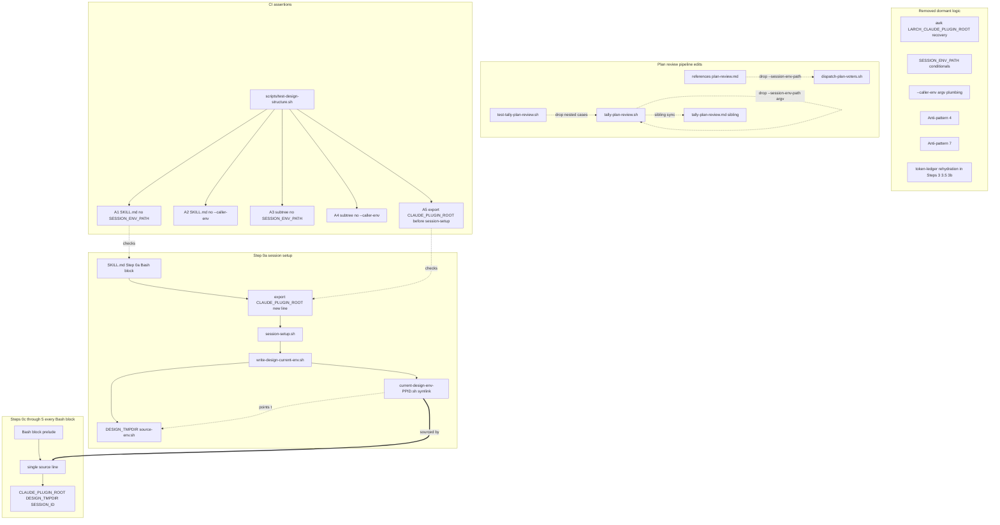

## Architecture Diagram

```mermaid
graph TD
    subgraph step0["Step 0a session setup"]
        SKILL[SKILL.md Step 0a Bash block]
        EXPORT[export CLAUDE_PLUGIN_ROOT new line]
        SS[session-setup.sh]
        WDCE[write-design-current-env.sh]
        SE[DESIGN_TMPDIR source-env.sh]
        SYM[current-design-env-PPID.sh symlink]

        SKILL --> EXPORT
        EXPORT --> SS
        SS --> WDCE
        WDCE --> SE
        WDCE --> SYM
        SYM -.points to.-> SE
    end

    subgraph later["Steps 0c through 5 every Bash block"]
        BLOCK[Bash block prelude]
        SRCLINE[single source line]
        VARS[CLAUDE_PLUGIN_ROOT DESIGN_TMPDIR SESSION_ID]

        BLOCK --> SRCLINE
        SRCLINE --> VARS
    end

    SYM ===>|sourced by| SRCLINE

    subgraph removed["Removed dormant logic"]
        AWK[awk LARCH_CLAUDE_PLUGIN_ROOT recovery]
        COND[SESSION_ENV_PATH conditionals]
        CALLER[--caller-env argv plumbing]
        AP4[Anti-pattern 4]
        AP7[Anti-pattern 7]
        REHYD[token-ledger rehydration in Steps 3 3.5 3b]
    end

    subgraph review["Plan review pipeline edits"]
        PRMD[references plan-review.md]
        DPV[dispatch-plan-voters.sh]
        TPR[tally-plan-review.sh]
        TPRMD[tally-plan-review.md sibling]
        TPRTEST[test-tally-plan-review.sh]

        PRMD -.drop --session-env-path.-> DPV
        TPR -.drop --session-env-path argv.-> TPR
        TPR -.sibling sync.-> TPRMD
        TPRTEST -.drop nested cases.-> TPR
    end

    subgraph ci["CI assertions"]
        TDS[scripts/test-design-structure.sh]
        A1[A1 SKILL.md no SESSION_ENV_PATH]
        A2[A2 SKILL.md no --caller-env]
        A3[A3 subtree no SESSION_ENV_PATH]
        A4[A4 subtree no --caller-env]
        A5[A5 export CLAUDE_PLUGIN_ROOT before session-setup]

        TDS --> A1
        TDS --> A2
        TDS --> A3
        TDS --> A4
        TDS --> A5
    end

    A1 -.checks.-> SKILL
    A5 -.checks.-> EXPORT
```
