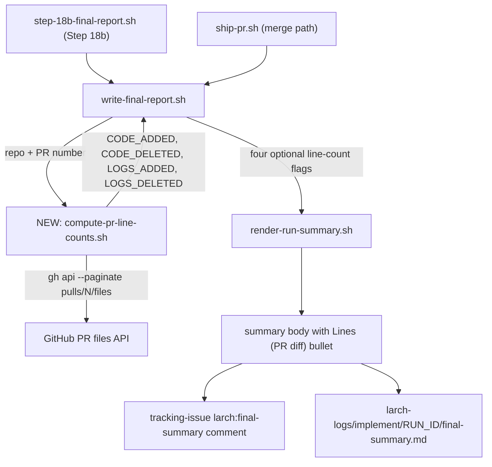

## Architecture Diagram

```mermaid
graph TD
    S18["step-18b-final-report.sh (Step 18b)"] --> WFR["write-final-report.sh"]
    SHIP["ship-pr.sh (merge path)"] --> WFR
    WFR -->|"repo + PR number"| CPL["NEW: compute-pr-line-counts.sh"]
    CPL -->|"gh api --paginate pulls/N/files"| API["GitHub PR files API"]
    CPL -->|"CODE_ADDED, CODE_DELETED, LOGS_ADDED, LOGS_DELETED"| WFR
    WFR -->|"four optional line-count flags"| RRS["render-run-summary.sh"]
    RRS --> BODY["summary body with Lines (PR diff) bullet"]
    BODY --> COMMENT["tracking-issue larch:final-summary comment"]
    BODY --> RUNLOG["larch-logs/implement/RUN_ID/final-summary.md"]
```
