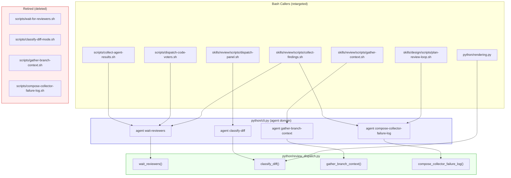

## Architecture Diagram

```mermaid
graph TD
    subgraph CLI["python/cli.py (agent domain)"]
        V1["agent wait-reviewers"]
        V2["agent classify-diff"]
        V3["agent gather-branch-context"]
        V4["agent compose-collector-failure-log"]
    end

    subgraph Module["python/review_dispatch.py"]
        WR["wait_reviewers()"]
        CD["classify_diff()"]
        GBC["gather_branch_context()"]
        CFL["compose_collector_failure_log()"]
    end

    V1 --> WR
    V2 --> CD
    V3 --> GBC
    V4 --> CFL

    subgraph Callers["Bash Callers (retargeted)"]
        CAR["scripts/collect-agent-results.sh"]
        DCV["scripts/dispatch-code-voters.sh"]
        CF["skills/review/scripts/collect-findings.sh"]
        DP["skills/review/scripts/dispatch-panel.sh"]
        GC["skills/review/scripts/gather-context.sh"]
        PRL["skills/design/scripts/plan-review-loop.sh"]
        REN["python/rendering.py"]
    end

    CAR --> V1
    DCV --> V1
    CF --> V1
    CF --> V4
    DP --> V2
    GC --> V3
    PRL --> V4
    REN --> CD

    subgraph Retired["Retired (deleted)"]
        S1["scripts/wait-for-reviewers.sh"]
        S2["scripts/classify-diff-mode.sh"]
        S3["scripts/gather-branch-context.sh"]
        S4["scripts/compose-collector-failure-log.sh"]
    end

    style Retired fill:#fee,stroke:#c00
    style Module fill:#efe,stroke:#090
    style CLI fill:#eef,stroke:#00c
```
