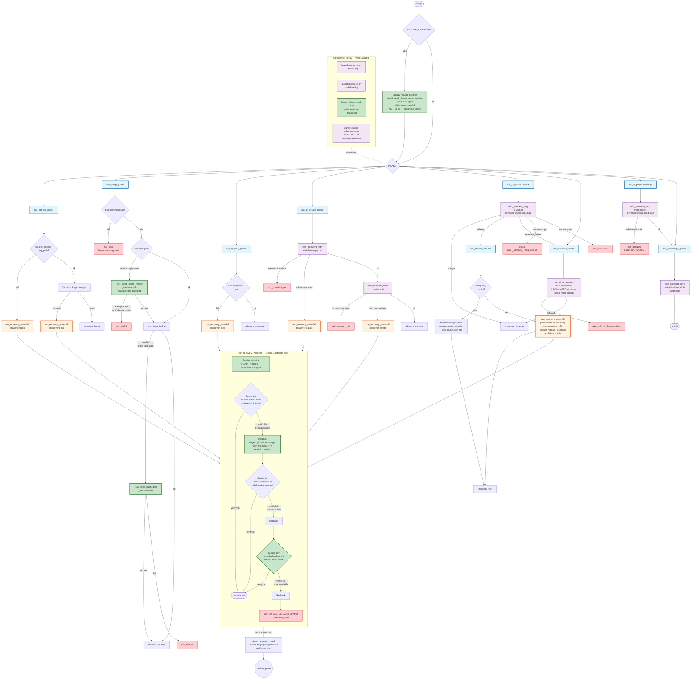

## Architecture Diagram

```mermaid
graph TD
    classDef phase fill:#e1f5fe,stroke:#01579b,stroke-width:2px
    classDef waterfall fill:#fff3e0,stroke:#e65100,stroke-width:2px
    classDef helper fill:#f3e5f5,stroke:#4a148c,stroke-width:1px
    classDef new fill:#c8e6c9,stroke:#1b5e20,stroke-width:2px
    classDef exit fill:#ffcdd2,stroke:#b71c1c,stroke-width:1px

    Start([entry]) --> Resume{RESUME_PHASE set?}
    Resume -->|yes| ResumeHandler[Legacy resume handler<br/>step8_apply_bump_same_version<br/>force-push-gate<br/>ship-pr-rrr-phase14<br/>NOT no-op — advances phase]:::new
    Resume -->|no| Loop
    ResumeHandler --> Loop

    Loop{PHASE} --> Checks
    Loop --> Bump
    Loop --> PrPrep
    Loop --> PrCreate
    Loop --> CiInitial
    Loop --> EvalFail
    Loop --> CiMerge
    Loop --> Postmerge

    Checks[run_checks_phase]:::phase --> ResolveLogA{resolve_checks_<br/>log_path?}
    ResolveLogA -->|fail| WfChecksA[run_recovery_waterfall<br/>phase=checks]:::waterfall
    ResolveLogA -->|ok| LintLoop[3× lint-fix-loop attempts]
    LintLoop -->|exhaust| WfChecksB[run_recovery_waterfall<br/>phase=checks]:::waterfall
    LintLoop -->|pass| BumpPhase[advance: bump]

    Bump[run_bump_phase]:::phase --> BumpGuard{bump-branch-guard}
    BumpGuard -->|fail| StallBumpGuard[exit_stall<br/>bump-branch-guard]:::exit
    BumpGuard -->|ok| ClassifyApply{classify+apply}
    ClassifyApply -->|version regression| Step8Mech[_run_step8_same_version<br/>_mechanically<br/>state counter persisted]:::new
    Step8Mech -->|attempt 1 fail<br/>or 2nd occurrence| StallBump[exit_stall 8]:::exit
    Step8Mech -->|recover| PostBump[postbump finalize]
    ClassifyApply -->|ok| PostBump
    PostBump -->|conflict<br/>force-push-gate| ForcePushMech[_run_force_push_gate<br/>_mechanically]:::new
    ForcePushMech -->|recover| PrPrepPhase[advance: pr-prep]
    ForcePushMech -->|fail| StallBumpB[exit_stall 8b]:::exit
    PostBump -->|ok| PrPrepPhase

    PrPrep[run_pr_prep_phase]:::phase --> OosGate{oos-disposition-<br/>gate}
    OosGate -->|fail| WfPrPrep[run_recovery_waterfall<br/>phase=pr-prep]:::waterfall
    OosGate -->|ok| PrCreatePhase[advance: pr-create]

    PrCreate[run_pr_create_phase]:::phase --> WriteFinalA[with_transient_retry<br/>write-final-report.sh]:::helper
    WriteFinalA -->|exhaust transient| ExitTransientA[exit_transient_net]:::exit
    WriteFinalA -->|fail non-transient| WfPrCreateA[run_recovery_waterfall<br/>phase=pr-create]:::waterfall
    WriteFinalA -->|ok| CreatePr[with_transient_retry<br/>create-pr.sh]:::helper
    CreatePr -->|exhaust transient| ExitTransientB[exit_transient_net]:::exit
    CreatePr -->|fail non-transient| WfPrCreateB[run_recovery_waterfall<br/>phase=pr-create]:::waterfall
    CreatePr -->|ok| CiInitialPhase[advance: ci-initial]

    CiInitial[run_ci_phase ci-initial]:::phase --> CiWait[with_transient_retry<br/>ci-wait.sh<br/>envelope-aware predicate]:::helper
    CiWait -->|merge| CiMergePhase[advance: ci-merge]
    CiWait -->|rebase| Rebase[run_rebase_rebump]
    CiWait -->|evaluate_failure| EvalFail
    CiWait -->|bail user-input| Exit3[exit 3 BAIL_NEEDS_USER_INPUT]:::exit
    CiWait -->|bail unknown| ExitStall10[exit_stall 10/12]:::exit

    Rebase[run_rebase_rebump]:::phase --> BumpConflict{bump-only<br/>conflict?}
    BumpConflict -->|yes| DetermPrePass[deterministic pre-pass<br/>auto-resolve-changelog<br/>--ours plugin.json etc]
    BumpConflict -->|no| WfRebase[run_recovery_waterfall<br/>phase=rebase-nonbump<br/>--role resolve-conflict<br/>verifier: rebase --continue<br/>+ plain-no-push]:::waterfall
    DetermPrePass --> RebumpPush
    WfRebase --> RebumpPush

    EvalFail[run_evaluate_failure]:::phase --> CiFixVendor[run_ci_fix_vendor<br/>3× cursor/codex<br/>UNCHANGED structure<br/>+ local-repro prompt]:::helper
    CiFixVendor -->|exhaust| ExitStallCi[exit_stall 10/12-max-retries]:::exit
    CiFixVendor -->|ok| CiMergePhase

    CiMerge[run_ci_phase ci-merge]:::phase --> MergePr[with_transient_retry<br/>merge-pr.sh<br/>envelope-aware predicate]:::helper
    MergePr -->|admin/policy fail| ExitStall12d[exit_stall 12d<br/>HARD BOUNDARY]:::exit
    MergePr -->|ok| Postmerge

    Postmerge[run_postmerge_phase]:::phase --> WriteFinalPM[with_transient_retry<br/>write-final-report.sh<br/>postmerge]:::helper
    WriteFinalPM --> Done([exit 0])

    WfChecksA --> WaterfallSubgraph
    WfChecksB --> WaterfallSubgraph
    WfPrPrep --> WaterfallSubgraph
    WfPrCreateA --> WaterfallSubgraph
    WfPrCreateB --> WaterfallSubgraph
    WfRebase --> WaterfallSubgraph

    subgraph WaterfallSubgraph[run_recovery_waterfall — 3 tiers, 1 attempt each]
        direction TB
        WfBaseline[Pre-tier baseline<br/>HEAD + tracked + untracked + staged]:::new
        WfBaseline --> WfCursor{Cursor tier<br/>launch-cursor-ci.sh<br/>--failure-log injected}
        WfCursor -->|verify ok| WfSuccess([tier success])
        WfCursor -->|verify fail<br/>or unavailable| WfRevert1[Rollback<br/>staged: git restore --staged<br/>then checkout + rm<br/>quoted -- pattern]:::new
        WfRevert1 --> WfCodex{Codex tier<br/>launch-codex-ci.sh<br/>--failure-log injected}
        WfCodex -->|verify ok| WfSuccess
        WfCodex -->|verify fail<br/>or unavailable| WfRevert2[Rollback]
        WfRevert2 --> WfClaude{Claude tier<br/>launch-claude-ci.sh<br/>NEW LAUNCHER}:::new
        WfClaude -->|verify ok| WfSuccess
        WfClaude -->|verify fail<br/>or unavailable| WfRevert3[Rollback]
        WfRevert3 --> WfExhaust[WATERFALL_EXHAUSTED=true<br/>caller exit_stalls]:::exit
    end

    WaterfallSubgraph -.->|tier success path| TierSuccess[stage + commit + push<br/>or skip for pr-prep/pr-create<br/>verify-as-rerun]
    TierSuccess -.-> ContinuePhase((continue phase))

    subgraph LaunchersSubgraph[CI launcher family — write-capable]
        LaunchCursorCi[launch-cursor-ci.sh<br/>+ --failure-log]:::helper
        LaunchCodexCi[launch-codex-ci.sh<br/>+ --failure-log]:::helper
        LaunchClaudeCi[launch-claude-ci.sh<br/>NEW<br/>writer persona<br/>--failure-log]:::new
        LaunchCSubproc[launch-claude-subprocess.sh<br/>UNCHANGED<br/>read-only reviewer]:::helper
    end

    LaunchersSubgraph -.->|consumer| Loop
```
