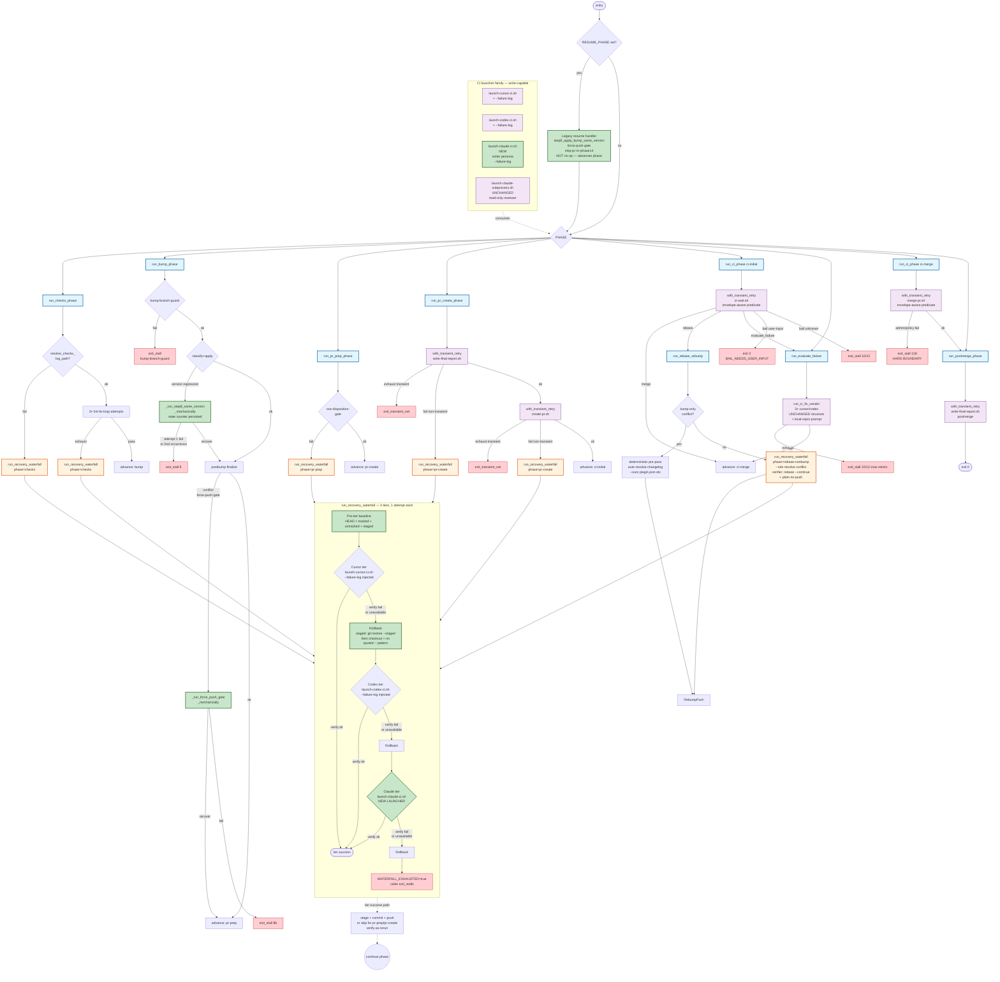

## Plan

**Note**: This is the FINAL plan, post-Gate B revision incorporating all 29 accepted plan-review findings. The 10-reviewer panel (5 Cursor + 5 Codex archetypes) and 3-voter adjudication (Claude + Codex + Cursor) signed off on this revision. The implementor should execute this plan exactly.

## Architecture Diagram

## Acceptance

1. `scripts/launch-claude-ci.sh` exists with argv mirroring cursor/codex CI launchers (including `--failure-log`), writer-persona prompt (no read-only preamble), local-reproduction invariant text, and ONLY `fix` / `resolve-conflict` roles. Sibling `.md` + harness exist and pass.

2. `run_recovery_waterfall` wired at 5 sites in `scripts/ship-pr.sh`: `run_checks_phase` at BOTH `exit_stall 6` sites (the earlier `resolve_checks_log_path` failure path AND the after-lint-loop path), `run_pr_prep_phase` exit_stall 9a1, `run_pr_create_phase` BOTH exit_stall 9b sites, `run_rebase_rebump` non-bump conflict block. Each site falls through to existing `exit_stall` on waterfall exhaustion. Verifier per phase: `run-relevant-checks-captured.sh` for checks/pr-prep; re-run failing helper for pr-create; `git rebase --continue` + `_run_rebase_rebump_verify_plain_no_push` for rebase-nonbump.

3. `with_transient_retry` is **envelope-aware**: takes a predicate parameter and retries on rc=0 transient envelopes for `merge-pr.sh` (`MERGE_RESULT=error|admin_failed`) and `ci-wait.sh` (`ACTION=bail BAIL_REASON=...`). Classification uses combined stderr+stdout (the `fail_file` contents).

4. Three `exit 5` paths absorbed in-script. The legacy `RESUME_PHASE` handler retains its existing semantics (advance phase + dispatch the per-token path), now backed by in-script mechanical recovery instead of prompt-side work. State-key documentation accurately describes the legacy mapping (`RESUME_PHASE=bump CALLER_KIND=step8_apply_bump_same_version`, NOT `RESUME_PHASE=step8_apply_bump_same_version`).

5. CI-fix local-reproduction invariant prompt text in `scripts/launch-cursor-ci.sh`, `scripts/launch-codex-ci.sh`, `scripts/launch-claude-ci.sh` for `--role fix`. `--failure-log` argv added to all three launchers (validated as absolute path under `$IMPLEMENT_TMPDIR`, content piped through `redact-secrets.sh` and capped at 4KB before injection into prompt). Argv shapes of cursor/codex launchers are extended (new optional flag), existing harness coverage adapted for the new flag.

6. 26 new `scripts/test-ship-pr.sh` cases pass. Existing cases continue to pass with stub updates as needed (relaxed acceptance wording per FINDING_12).

7. 14 new `scripts/test-launch-claude-ci.sh` cases pass. `scripts/test-launch-cursor-ci.sh` and `scripts/test-launch-codex-ci.sh` each gain 3 new cases for the `--failure-log` argv and local-reproduction invariant.

8. Bash 3.2: `make lint-bash32` passes. Per-tier rollback uses `--` sentinel + quoted-`while read` loop (no unquoted `$delta` expansion). No `local -n`, no `mapfile`, no `&>>`, no `declare -A`.

9. Source-safe testing: `scripts/ship-pr.sh` can be `source`d without ANY side effects. ALL top-level executable logic (argv parsing, validation, state init, RESUME_PHASE handler, main loop) is wrapped in a `main()` function gated by `if [[ "${BASH_SOURCE[0]}" == "${0}" ]]; then main "$@"; fi`.

10. `scripts/ship-pr.md`, `scripts/launch-cursor-ci.md`, `scripts/launch-codex-ci.md`, new `scripts/launch-claude-ci.md` reflect runtime changes accurately (especially the legacy RESUME_PHASE handler semantics — `ship-pr-rrr-phase14` is NOT a no-op, it advances the phase and runs `run_rebase_rebump`). `scripts/lib-timing-kinds.sh` includes `claude-ci-fix`. `Makefile` registers `scripts/test-launch-claude-ci.sh` in the appropriate shard.

11. No new emitters of `exit 5` in `scripts/ship-pr.sh` (CI structure assertion). No new emitters of `exit_transient_net` outside the `with_transient_retry` fall-through path.

12. The unquoted-path rollback security risk (FINDING_14/F23) is structurally prevented by the `--` sentinel + quoted-argument `while read` pattern; tests `recovery_waterfall_rollback_handles_paths_with_spaces_and_globs` and `recovery_waterfall_rollback_restores_staged_changes_via_git_restore_staged` pin the safe behavior.

13. `make lint` and `bash scripts/relevant-checks.sh` pass cleanly. No regression in existing harness coverage.

diff_lines: 1480
