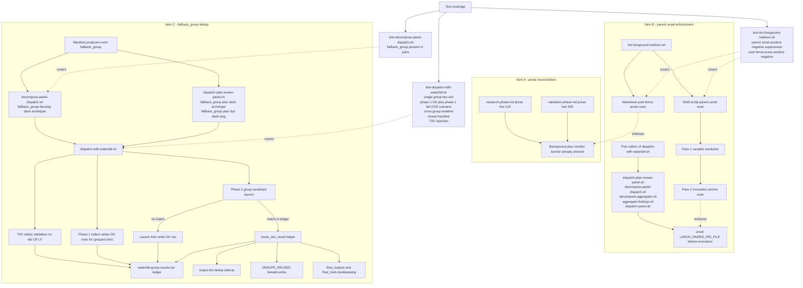

## Architecture Diagram

```mermaid
flowchart TD
    subgraph ItemA [Item A - prose reconciliation]
        rp[research-phase.md prose line 215]
        vp[validation-phase.md prose line 209]
        bf[Background plus monitor banner already present]
        rp --> bf
        vp --> bf
    end

    subgraph ItemB [Item B - parent unset enforcement]
        callers[Five callers of dispatch-with-waterfall.sh]
        callers_list[dispatch-plan-review-panel.sh<br/>decompose-panel-dispatch.sh<br/>decompose-aggregator.sh<br/>aggregate-findings.sh<br/>dispatch-panel.sh]
        unset_stmt[unset LARCH_PAIRED_PID_FILE before invocation]
        lint[lint-foreground-markers.sh]
        lint_md[Markdown post fence prose scan]
        lint_sh[Shell script parent unset scan]
        lint_sh_var[Pass 1 variable resolution]
        lint_sh_inv[Pass 2 invocation anchor scan]
        callers --> callers_list
        callers_list --> unset_stmt
        lint --> lint_md
        lint --> lint_sh
        lint_sh --> lint_sh_var
        lint_sh_var --> lint_sh_inv
        lint_sh_inv -. enforces .-> unset_stmt
        lint_md -. enforces .-> bf
    end

    subgraph ItemC [Item C - fallback_group dedup]
        manifest[Manifest producers emit fallback_group]
        mp_decomp[decompose-panel-dispatch.sh<br/>fallback_group decomp dash archetype]
        mp_plan[dispatch-plan-review-panel.sh<br/>fallback_group plan dash archetype<br/>fallback_group plan dyn dash slug]
        dispatcher[dispatch-with-waterfall.sh]
        validation[TSV safety validation no tab CR LF]
        ledger[waterfall-group-results.tsv ledger]
        phase1[Phase 1 collect writes OK rows for grouped slots]
        phase2[Phase 2 group serialized launch]
        reuse[reuse_slot_result helper]
        sidecar[output dot dedup sidecar]
        kv[DEDUPE_REUSED breadcrumbs]
        finalarr[final_outputs and final_tools bookkeeping]
        manifest --> mp_decomp
        manifest --> mp_plan
        mp_decomp --> dispatcher
        mp_plan --> dispatcher
        dispatcher --> validation
        validation --> ledger
        dispatcher --> phase1
        phase1 --> ledger
        dispatcher --> phase2
        phase2 -- match in ledger --> reuse
        phase2 -- no match --> phase2_launch[Launch then write OK row]
        phase2_launch --> ledger
        reuse --> sidecar
        reuse --> kv
        reuse --> finalarr
        reuse --> ledger
    end

    tests[Test coverage]
    tests_lint[test-lint-foreground-markers.sh<br/>parent unset positive negative suppression<br/>post fence prose positive negative]
    tests_disp[test-dispatch-with-waterfall.sh<br/>single group two slot<br/>phase 1 OK plus phase 1 fail OOS scenario<br/>cross group isolation<br/>mixed manifest<br/>TSV rejection]
    tests_decomp[test-decompose-panel-dispatch.sh<br/>fallback_group present in pairs]
    tests --> tests_lint
    tests --> tests_disp
    tests --> tests_decomp
    tests_lint -. covers .-> lint_md
    tests_lint -. covers .-> lint_sh
    tests_disp -. covers .-> dispatcher
    tests_decomp -. covers .-> mp_decomp
```
