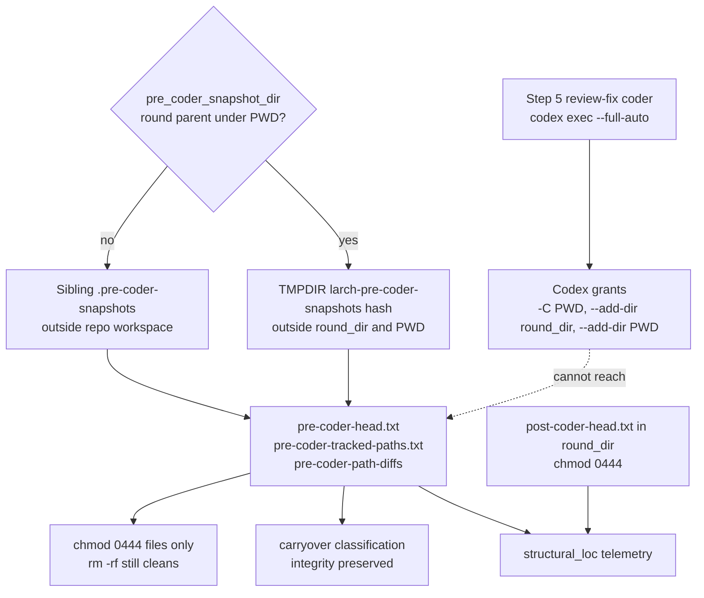

## Architecture Diagram

```mermaid
graph TD
    Coder["Step 5 review-fix coder<br/>codex exec --full-auto"]
    Grants["Codex grants<br/>-C PWD, --add-dir round_dir, --add-dir PWD"]
    Helper{"pre_coder_snapshot_dir<br/>round parent under PWD?"}
    Sibling["Sibling .pre-coder-snapshots<br/>outside repo workspace"]
    Reloc["TMPDIR larch-pre-coder-snapshots hash<br/>outside round_dir and PWD"]
    Snaps["pre-coder-head.txt<br/>pre-coder-tracked-paths.txt<br/>pre-coder-path-diffs"]
    Harden["chmod 0444 files only<br/>rm -rf still cleans"]
    PostHead["post-coder-head.txt in round_dir<br/>chmod 0444"]
    Telemetry["structural_loc telemetry"]
    Carryover["carryover classification<br/>integrity preserved"]

    Coder --> Grants
    Helper -->|no| Sibling
    Helper -->|yes| Reloc
    Sibling --> Snaps
    Reloc --> Snaps
    Snaps --> Harden
    Grants -. cannot reach .-> Snaps
    Snaps --> Carryover
    PostHead --> Telemetry
    Snaps --> Telemetry
```
