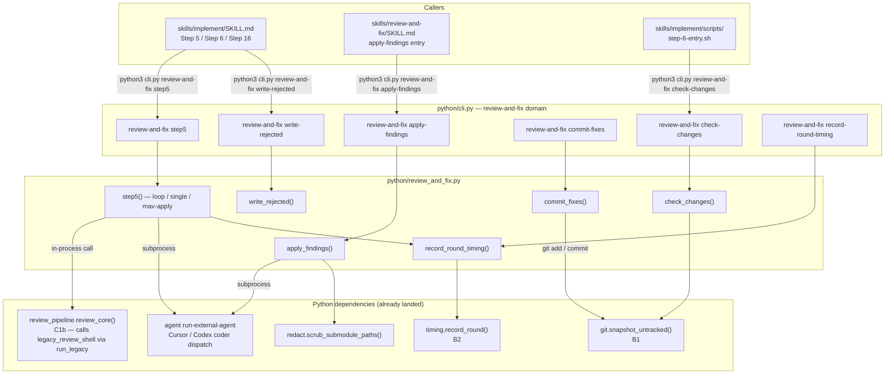

## Architecture Diagram

```mermaid
graph TD
    subgraph Callers
        IMPL_SK["skills/implement/SKILL.md\nStep 5 / Step 6 / Step 16"]
        RAF_SK["skills/review-and-fix/SKILL.md\napply-findings entry"]
        STEP6["skills/implement/scripts/\nstep-6-entry.sh"]
    end

    subgraph CLI["python/cli.py — review-and-fix domain"]
        APPLY["review-and-fix apply-findings"]
        STEP5["review-and-fix step5"]
        CHKCHG["review-and-fix check-changes"]
        COMMIT["review-and-fix commit-fixes"]
        WREJ["review-and-fix write-rejected"]
        RRTIM["review-and-fix record-round-timing"]
    end

    subgraph Module["python/review_and_fix.py"]
        AF["apply_findings()"]
        S5["step5() — loop / single / mav-apply"]
        CC["check_changes()"]
        CF["commit_fixes()"]
        WR["write_rejected()"]
        RRT["record_round_timing()"]
    end

    subgraph Deps["Python dependencies (already landed)"]
        RCORE["review_pipeline.review_core()\nC1b — calls legacy_review_shell via run_legacy"]
        TIMING["timing.record_round()\nB2"]
        GIT["git.snapshot_untracked()\nB1"]
        AGENT["agent run-external-agent\nCursor / Codex coder dispatch"]
        REDACT["redact.scrub_submodule_paths()"]
    end

    IMPL_SK -->|"python3 cli.py review-and-fix step5"| STEP5
    IMPL_SK -->|"python3 cli.py review-and-fix write-rejected"| WREJ
    RAF_SK -->|"python3 cli.py review-and-fix apply-findings"| APPLY
    STEP6 -->|"python3 cli.py review-and-fix check-changes"| CHKCHG

    APPLY --> AF
    STEP5 --> S5
    CHKCHG --> CC
    COMMIT --> CF
    WREJ --> WR
    RRTIM --> RRT

    S5 -->|in-process call| RCORE
    S5 -->|subprocess| AGENT
    S5 --> RRT
    AF -->|subprocess| AGENT
    AF --> REDACT
    CC --> GIT
    CF -->|git add / commit| GIT
    RRT --> TIMING
```
