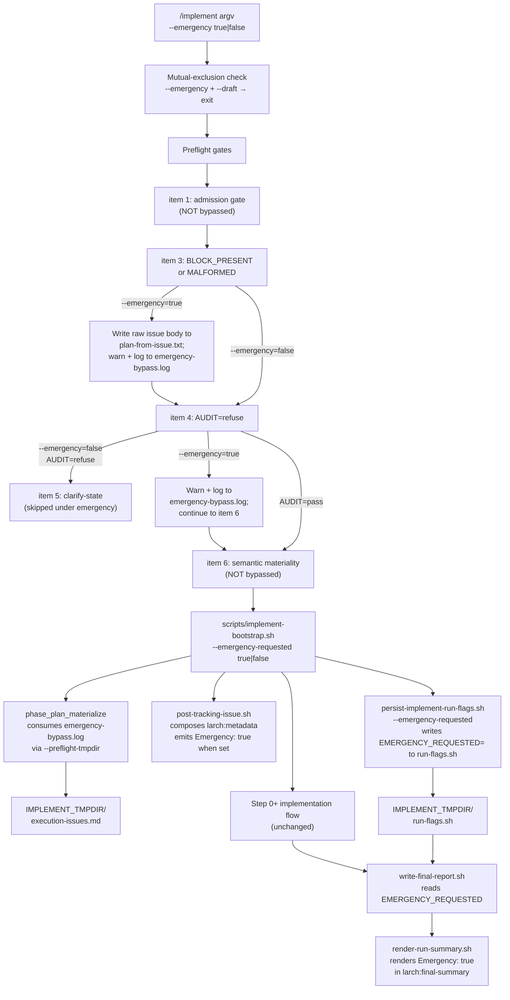

## Architecture Diagram

```mermaid
flowchart TD
  Argv["/implement argv<br/>--emergency true|false"]
  Mutex["Mutual-exclusion check<br/>--emergency + --draft → exit"]
  Preflight["Preflight gates"]
  Item1["item 1: admission gate<br/>(NOT bypassed)"]
  Item3["item 3: BLOCK_PRESENT<br/>or MALFORMED"]
  Item4["item 4: AUDIT=refuse"]
  Item5["item 5: clarify-state<br/>(skipped under emergency)"]
  Item6["item 6: semantic materiality<br/>(NOT bypassed)"]
  Bypass3["Write raw issue body to<br/>plan-from-issue.txt;<br/>warn + log to emergency-bypass.log"]
  Bypass4["Warn + log to<br/>emergency-bypass.log;<br/>continue to item 6"]
  Bootstrap["scripts/implement-bootstrap.sh<br/>--emergency-requested true|false"]
  Persist["persist-implement-run-flags.sh<br/>--emergency-requested<br/>writes EMERGENCY_REQUESTED= to run-flags.sh"]
  PostTracking["post-tracking-issue.sh<br/>composes larch:metadata<br/>emits Emergency: true when set"]
  PhasePlan["phase_plan_materialize<br/>consumes emergency-bypass.log<br/>via --preflight-tmpdir"]
  ExecIssues["IMPLEMENT_TMPDIR/<br/>execution-issues.md"]
  RunFlags["IMPLEMENT_TMPDIR/<br/>run-flags.sh"]
  Final["write-final-report.sh<br/>reads EMERGENCY_REQUESTED"]
  Render["render-run-summary.sh<br/>renders Emergency: true<br/>in larch:final-summary"]
  Step0["Step 0+ implementation flow<br/>(unchanged)"]

  Argv --> Mutex
  Mutex --> Preflight
  Preflight --> Item1
  Item1 --> Item3
  Item3 -- "--emergency=true" --> Bypass3
  Bypass3 --> Item4
  Item3 -- "--emergency=false" --> Item4
  Item4 -- "--emergency=true" --> Bypass4
  Bypass4 --> Item6
  Item4 -- "--emergency=false<br/>AUDIT=refuse" --> Item5
  Item4 -- "AUDIT=pass" --> Item6
  Item6 --> Bootstrap
  Bootstrap --> Persist
  Bootstrap --> PostTracking
  Bootstrap --> PhasePlan
  PhasePlan --> ExecIssues
  Persist --> RunFlags
  Bootstrap --> Step0
  Step0 --> Final
  RunFlags --> Final
  Final --> Render
```
