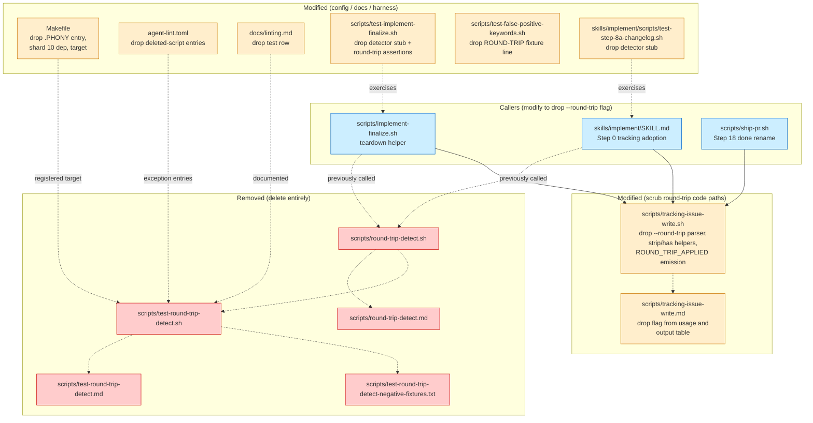

## Architecture Diagram

```mermaid
graph TD
    subgraph "Callers (modify to drop --round-trip flag)"
        IMPLEMENT_SKILL["skills/implement/SKILL.md<br/>Step 0 tracking adoption"]
        IMPLEMENT_FINALIZE["scripts/implement-finalize.sh<br/>teardown helper"]
        SHIP_PR["scripts/ship-pr.sh<br/>Step 18 done rename"]
    end

    subgraph "Removed (delete entirely)"
        DETECTOR["scripts/round-trip-detect.sh"]
        DETECTOR_MD["scripts/round-trip-detect.md"]
        TEST_DETECTOR["scripts/test-round-trip-detect.sh"]
        TEST_DETECTOR_MD["scripts/test-round-trip-detect.md"]
        FIXTURES["scripts/test-round-trip-detect-negative-fixtures.txt"]
    end

    subgraph "Modified (scrub round-trip code paths)"
        WRITE_SH["scripts/tracking-issue-write.sh<br/>drop --round-trip parser,<br/>strip/has helpers,<br/>ROUND_TRIP_APPLIED emission"]
        WRITE_MD["scripts/tracking-issue-write.md<br/>drop flag from usage and<br/>output table"]
    end

    subgraph "Modified (config / docs / harness)"
        MAKEFILE["Makefile<br/>drop .PHONY entry,<br/>shard 10 dep, target"]
        AGENT_LINT["agent-lint.toml<br/>drop deleted-script entries"]
        DOCS_LINT["docs/linting.md<br/>drop test row"]
        TEST_FINALIZE["scripts/test-implement-finalize.sh<br/>drop detector stub +<br/>round-trip assertions"]
        TEST_FALSE_POS["scripts/test-false-positive-keywords.sh<br/>drop ROUND-TRIP fixture line"]
        TEST_CHANGELOG["skills/implement/scripts/test-step-8a-changelog.sh<br/>drop detector stub"]
    end

    IMPLEMENT_SKILL -.->|previously called| DETECTOR
    IMPLEMENT_FINALIZE -.->|previously called| DETECTOR
    IMPLEMENT_SKILL --> WRITE_SH
    IMPLEMENT_FINALIZE --> WRITE_SH
    SHIP_PR --> WRITE_SH

    DETECTOR -.-> DETECTOR_MD
    DETECTOR -.-> TEST_DETECTOR
    TEST_DETECTOR -.-> TEST_DETECTOR_MD
    TEST_DETECTOR -.-> FIXTURES

    WRITE_SH -.-> WRITE_MD

    MAKEFILE -.->|registered target| TEST_DETECTOR
    AGENT_LINT -.->|exception entries| TEST_DETECTOR
    DOCS_LINT -.->|documented| TEST_DETECTOR

    TEST_FINALIZE -.->|exercises| IMPLEMENT_FINALIZE
    TEST_CHANGELOG -.->|exercises| IMPLEMENT_SKILL

    classDef removed fill:#ffcccc,stroke:#cc0000
    classDef modified fill:#ffeecc,stroke:#cc7700
    classDef caller fill:#cceeff,stroke:#0066cc
    class DETECTOR,DETECTOR_MD,TEST_DETECTOR,TEST_DETECTOR_MD,FIXTURES removed
    class WRITE_SH,WRITE_MD,MAKEFILE,AGENT_LINT,DOCS_LINT,TEST_FINALIZE,TEST_FALSE_POS,TEST_CHANGELOG modified
    class IMPLEMENT_SKILL,IMPLEMENT_FINALIZE,SHIP_PR caller
```
