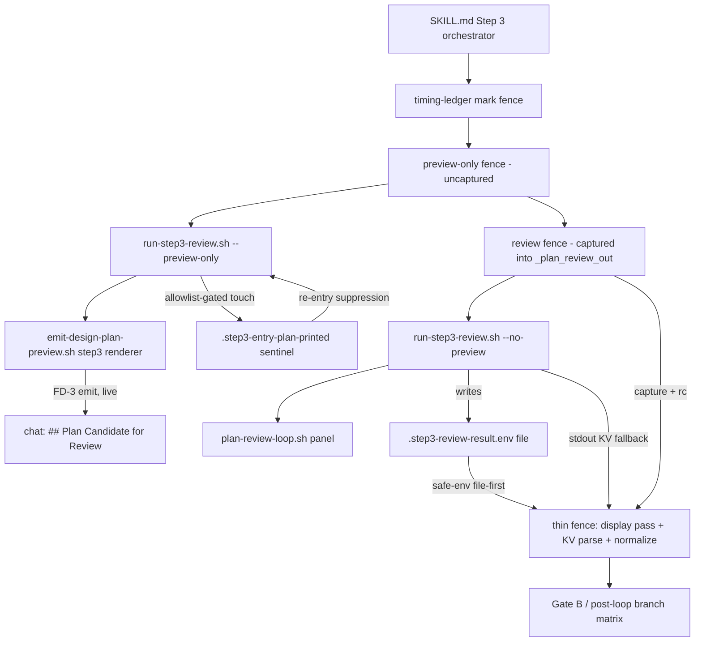

## Architecture Diagram

```mermaid
graph TD
    SKILL["SKILL.md Step 3 orchestrator"]
    TIMING["timing-ledger mark fence"]
    PVFENCE["preview-only fence - uncaptured"]
    REVFENCE["review fence - captured into _plan_review_out"]
    THIN["thin fence: display pass + KV parse + normalize"]
    GATEB["Gate B / post-loop branch matrix"]

    DRIVER_PV["run-step3-review.sh --preview-only"]
    DRIVER_REV["run-step3-review.sh --no-preview"]
    RENDER["emit-design-plan-preview.sh step3 renderer"]
    LOOP["plan-review-loop.sh panel"]

    SENTINEL[".step3-entry-plan-printed sentinel"]
    RESULTENV[".step3-review-result.env file"]
    CHAT["chat: ## Plan Candidate for Review"]

    SKILL --> TIMING
    TIMING --> PVFENCE
    PVFENCE --> DRIVER_PV
    DRIVER_PV --> RENDER
    RENDER -->|"FD-3 emit, live"| CHAT
    DRIVER_PV -->|"allowlist-gated touch"| SENTINEL
    SENTINEL -->|"re-entry suppression"| DRIVER_PV

    PVFENCE --> REVFENCE
    REVFENCE --> DRIVER_REV
    DRIVER_REV --> LOOP
    DRIVER_REV -->|"writes"| RESULTENV
    DRIVER_REV -->|"stdout KV fallback"| THIN
    RESULTENV -->|"safe-env file-first"| THIN
    REVFENCE -->|"capture + rc"| THIN
    THIN --> GATEB
```
