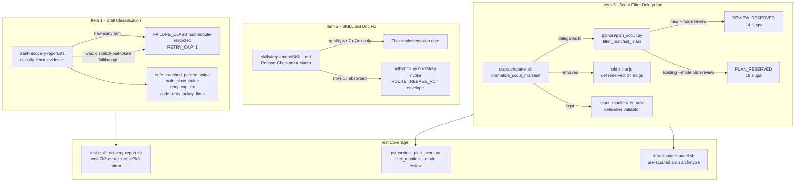

## Architecture Diagram

```mermaid
graph TD
    subgraph Item1 [Item 1 - Stall Classification]
        SRR[stall-recovery-report.sh\nclassify_from_evidence] --> |new early arm| SubClass[FAILURE_CLASS=submodule-restricted\nRETRY_CAP=1]
        SRR --> |was: dispatch-bail-token fallthrough| SubClass
        SRR --> SafeAllow[safe_matched_pattern_value\nsafe_class_value\nretry_cap_for\ncode_retry_policy_lines]
    end

    subgraph Item5 [Item 5 - SKILL.md Doc Fix]
        SKILL[skills/implement/SKILL.md\nRebase Checkpoint Macro] --> |qualify 4.r 7.r 7a.r only| Thin[Thin implementation note]
        SKILL --> |note 1.r absorbed| Bootstrap[python/cli.py bootstrap invoke\nROUTE= REBASE_RC= envelope]
    end

    subgraph Item6 [Item 6 - Scout Filter Delegation]
        PlanScout[python/plan_scout.py\nfilter_manifest_main] --> |new --mode review| ReviewMode[REVIEW_RESERVED\n14 slugs]
        PlanScout --> |existing --mode plan-review| PlanMode[PLAN_RESERVED\n19 slugs]
        DispatchPanel[dispatch-panel.sh\nnormalize_scout_manifest] --> |delegates to| PlanScout
        DispatchPanel --> |removed| InlineJQ[old inline jq\ndef reserved: 14 slugs]
        DispatchPanel --> |kept| ValidCheck[scout_manifest_is_valid\ndefensive validator]
    end

    subgraph Tests [Test Coverage]
        TestSRR[test-stall-recovery-report.sh\ncase7k2-mirror + case7k3-mirror]
        TestScout[python/test_plan_scout.py\nfilter_manifest --mode review]
        TestPanel[test-dispatch-panel.sh\npre-scouted arch archetype]
    end

    Item1 --> TestSRR
    Item6 --> TestScout
    Item6 --> TestPanel
```
