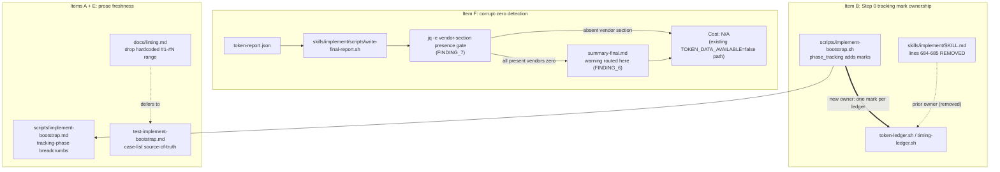

## Architecture Diagram

```mermaid
flowchart TD
    subgraph TelemetryMigration["Item B: Step 0 tracking mark ownership"]
        SKILL["skills/implement/SKILL.md<br/>lines 684-685 REMOVED"]
        Bootstrap["scripts/implement-bootstrap.sh<br/>phase_tracking adds marks"]
        Ledger["token-ledger.sh / timing-ledger.sh"]
        SKILL -.->|"prior owner (removed)"| Ledger
        Bootstrap ==>|"new owner: one mark per ledger"| Ledger
    end

    subgraph CorruptZero["Item F: corrupt-zero detection"]
        TokenJson["token-report.json"]
        WriteFinal["skills/implement/scripts/write-final-report.sh"]
        VendorGate["jq -e vendor-section presence gate<br/>(FINDING_7)"]
        SummaryBody["summary-final.md<br/>warning routed here (FINDING_6)"]
        CostRender["Cost: N/A<br/>(existing TOKEN_DATA_AVAILABLE=false path)"]
        TokenJson --> WriteFinal
        WriteFinal --> VendorGate
        VendorGate -->|"all present vendors zero"| SummaryBody
        VendorGate -->|"absent vendor section"| CostRender
        SummaryBody --> CostRender
    end

    subgraph Docs["Items A + E: prose freshness"]
        BootstrapMd["scripts/implement-bootstrap.md<br/>tracking-phase breadcrumbs"]
        LintingMd["docs/linting.md<br/>drop hardcoded #1-#N range"]
        TestMd["test-implement-bootstrap.md<br/>case-list source-of-truth"]
        LintingMd -.->|"defers to"| TestMd
    end

    Bootstrap --> BootstrapMd
```
