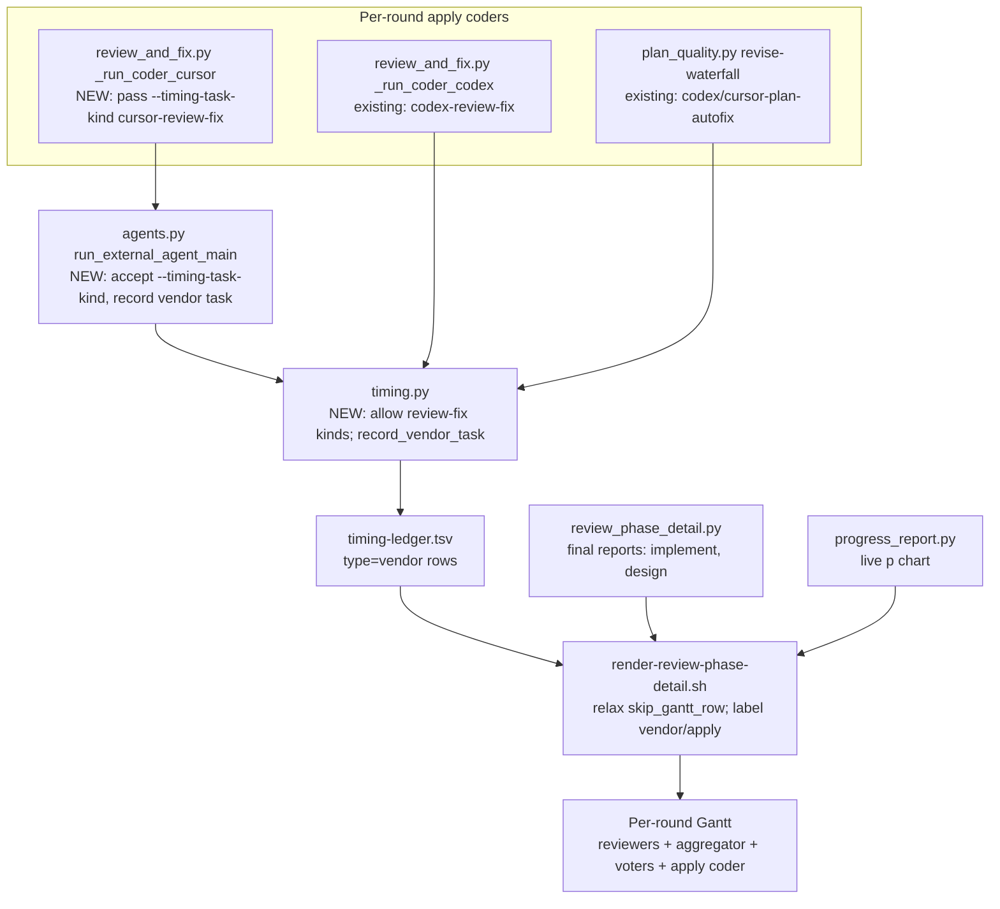

## Architecture Diagram

```mermaid
graph TD
    subgraph apply["Per-round apply coders"]
        cur["review_and_fix.py _run_coder_cursor<br/>NEW: pass --timing-task-kind cursor-review-fix"]
        cod["review_and_fix.py _run_coder_codex<br/>existing: codex-review-fix"]
        des["plan_quality.py revise-waterfall<br/>existing: codex/cursor-plan-autofix"]
    end

    ext["agents.py run_external_agent_main<br/>NEW: accept --timing-task-kind, record vendor task"]
    tim["timing.py<br/>NEW: allow review-fix kinds; record_vendor_task"]
    led["timing-ledger.tsv<br/>type=vendor rows"]
    ren["render-review-phase-detail.sh<br/>relax skip_gantt_row; label vendor/apply"]
    fin["review_phase_detail.py<br/>final reports: implement, design"]
    liv["progress_report.py<br/>live p chart"]
    gantt["Per-round Gantt<br/>reviewers + aggregator + voters + apply coder"]

    cur --> ext
    ext --> tim
    cod --> tim
    des --> tim
    tim --> led
    led --> ren
    fin --> ren
    liv --> ren
    ren --> gantt
```
