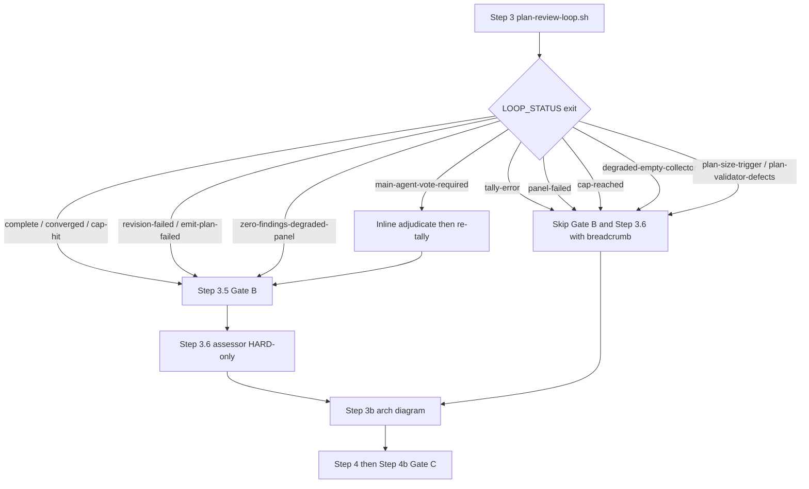

## Architecture Diagram

```mermaid
flowchart TD
    S3["Step 3 plan-review-loop.sh"] --> EXIT{"LOOP_STATUS exit"}

    EXIT -->|"complete / converged / cap-hit"| GB["Step 3.5 Gate B"]
    EXIT -->|"revision-failed / emit-plan-failed"| GB
    EXIT -->|"zero-findings-degraded-panel"| GB
    EXIT -->|"main-agent-vote-required"| MAV["Inline adjudicate then re-tally"]
    MAV --> GB

    GB --> A36["Step 3.6 assessor HARD-only"]

    EXIT -->|"tally-error"| SKIP["Skip Gate B and Step 3.6 with breadcrumb"]
    EXIT -->|"panel-failed"| SKIP
    EXIT -->|"cap-reached"| SKIP
    EXIT -->|"degraded-empty-collector"| SKIP
    EXIT -->|"plan-size-trigger / plan-validator-defects"| SKIP

    A36 --> S3B["Step 3b arch diagram"]
    SKIP --> S3B
    S3B --> S4["Step 4 then Step 4b Gate C"]
```
