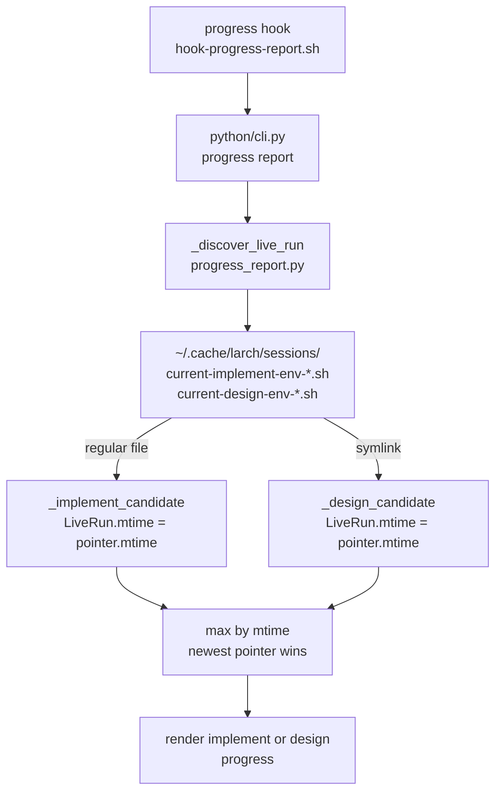

## Architecture Diagram

```mermaid
graph TD
    Hook["progress hook\nhook-progress-report.sh"] --> Report["python/cli.py\nprogress report"]
    Report --> Discover["_discover_live_run\nprogress_report.py"]
    Discover --> SessionsDir["~/.cache/larch/sessions/\ncurrent-implement-env-*.sh\ncurrent-design-env-*.sh"]
    SessionsDir -->|"regular file"| ImplCandidate["_implement_candidate\nLiveRun.mtime = pointer.mtime"]
    SessionsDir -->|"symlink"| DesignCandidate["_design_candidate\nLiveRun.mtime = pointer.mtime"]
    ImplCandidate --> Max["max by mtime\nnewest pointer wins"]
    DesignCandidate --> Max
    Max --> Render["render implement or design\nprogress"]
```
