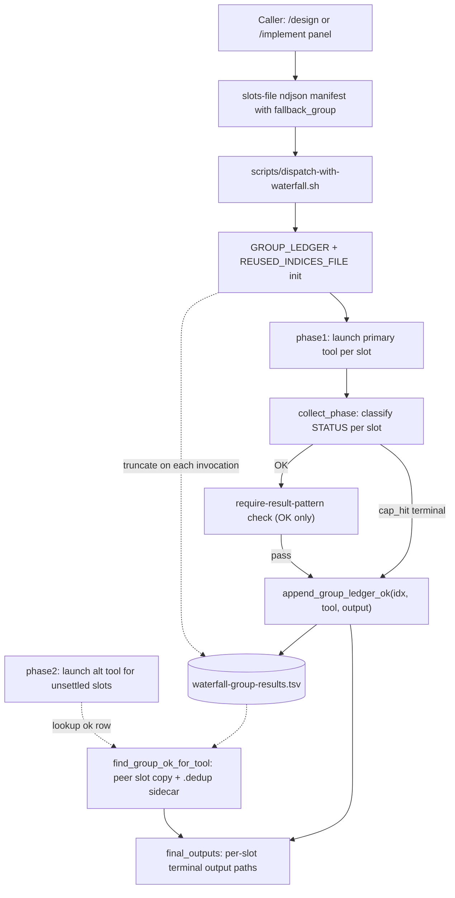

## Architecture Diagram

```mermaid
flowchart TD
    Caller["Caller: /design or /implement panel"]
    Slots["slots-file ndjson manifest with fallback_group"]
    Dispatcher["scripts/dispatch-with-waterfall.sh"]
    LedgerInit["GROUP_LEDGER + REUSED_INDICES_FILE init"]
    Phase1["phase1: launch primary tool per slot"]
    Collect["collect_phase: classify STATUS per slot"]
    Pattern["require-result-pattern check (OK only)"]
    LedgerWrite["append_group_ledger_ok(idx, tool, output)"]
    Phase2["phase2: launch alt tool for unsettled slots"]
    Reuse["find_group_ok_for_tool: peer slot copy + .dedup sidecar"]
    Output["final_outputs: per-slot terminal output paths"]
    Ledger[("waterfall-group-results.tsv")]

    Caller --> Slots
    Slots --> Dispatcher
    Dispatcher --> LedgerInit
    LedgerInit -.->|truncate on each invocation| Ledger
    LedgerInit --> Phase1
    Phase1 --> Collect
    Collect -->|OK| Pattern
    Collect -->|cap_hit terminal| LedgerWrite
    Pattern -->|pass| LedgerWrite
    LedgerWrite --> Ledger
    LedgerWrite --> Output
    Phase2 -.->|lookup ok row| Reuse
    Ledger -.-> Reuse
    Reuse --> Output
```
