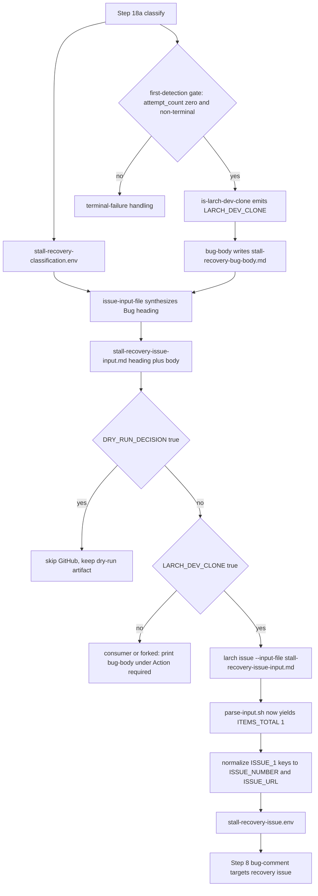

## Architecture Diagram

```mermaid
flowchart TD
    classify["Step 18a classify"] --> classenv["stall-recovery-classification.env"]
    classify --> gate{"first-detection gate: attempt_count zero and non-terminal"}
    gate -->|no| terminal["terminal-failure handling"]
    gate -->|yes| devclone["is-larch-dev-clone emits LARCH_DEV_CLONE"]
    devclone --> bugbody["bug-body writes stall-recovery-bug-body.md"]
    classenv --> issueinput
    bugbody --> issueinput["issue-input-file synthesizes Bug heading"]
    issueinput --> inputfile["stall-recovery-issue-input.md heading plus body"]
    inputfile --> dry{"DRY_RUN_DECISION true"}
    dry -->|yes| skip["skip GitHub, keep dry-run artifact"]
    dry -->|no| devmode{"LARCH_DEV_CLONE true"}
    devmode -->|no| chatprint["consumer or forked: print bug-body under Action required"]
    devmode -->|yes| file["larch issue --input-file stall-recovery-issue-input.md"]
    file --> parse["parse-input.sh now yields ITEMS_TOTAL 1"]
    parse --> normalize["normalize ISSUE_1 keys to ISSUE_NUMBER and ISSUE_URL"]
    normalize --> issueenv["stall-recovery-issue.env"]
    issueenv --> bugcomment["Step 8 bug-comment targets recovery issue"]
```
