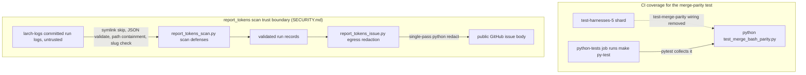

## Architecture Diagram

```mermaid
graph TD
    subgraph CIcoverage["CI coverage for the merge-parity test"]
        Shard["test-harnesses-5 shard"]
        PyJob["python-tests job runs make py-test"]
        Parity["python test_merge_bash_parity.py"]
        Shard -. "test-merge-parity wiring removed" .-> Parity
        PyJob -->|"pytest collects it"| Parity
    end
    subgraph TrustBoundary["report_tokens scan trust boundary (SECURITY.md)"]
        Logs["larch-logs committed run logs, untrusted"]
        ScanPath["report_tokens_scan.py scan defenses"]
        Records["validated run records"]
        Egress["report_tokens_issue.py egress redaction"]
        Public["public GitHub issue body"]
        Logs -->|"symlink skip, JSON validate, path containment, slug check"| ScanPath
        ScanPath --> Records
        Records --> Egress
        Egress -->|"single-pass python redact"| Public
    end
```
