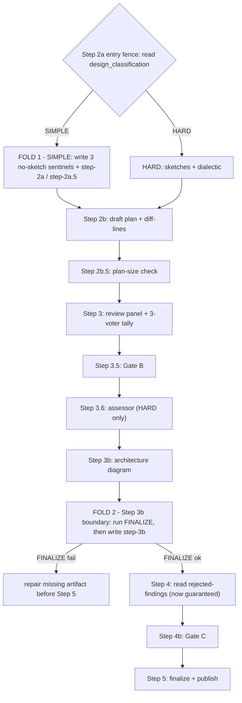

## Architecture Diagram

```mermaid
graph TD
    A2{"Step 2a entry fence: read design_classification"}
    A3["FOLD 1 - SIMPLE: write 3 no-sketch sentinels + step-2a / step-2a.5"]
    H["HARD: sketches + dialectic"]
    B["Step 2b: draft plan + diff-lines"]
    C["Step 2b.5: plan-size check"]
    D["Step 3: review panel + 3-voter tally"]
    E["Step 3.5: Gate B"]
    F["Step 3.6: assessor (HARD only)"]
    G1["Step 3b: architecture diagram"]
    G2["FOLD 2 - Step 3b boundary: run FINALIZE, then write step-3b"]
    X["repair missing artifact before Step 5"]
    I["Step 4: read rejected-findings (now guaranteed)"]
    J["Step 4b: Gate C"]
    K["Step 5: finalize + publish"]
    A2 -->|SIMPLE| A3
    A2 -->|HARD| H
    A3 --> B
    H --> B
    B --> C
    C --> D
    D --> E
    E --> F
    F --> G1
    G1 --> G2
    G2 -->|FINALIZE ok| I
    G2 -->|FINALIZE fail| X
    I --> J
    J --> K
```
