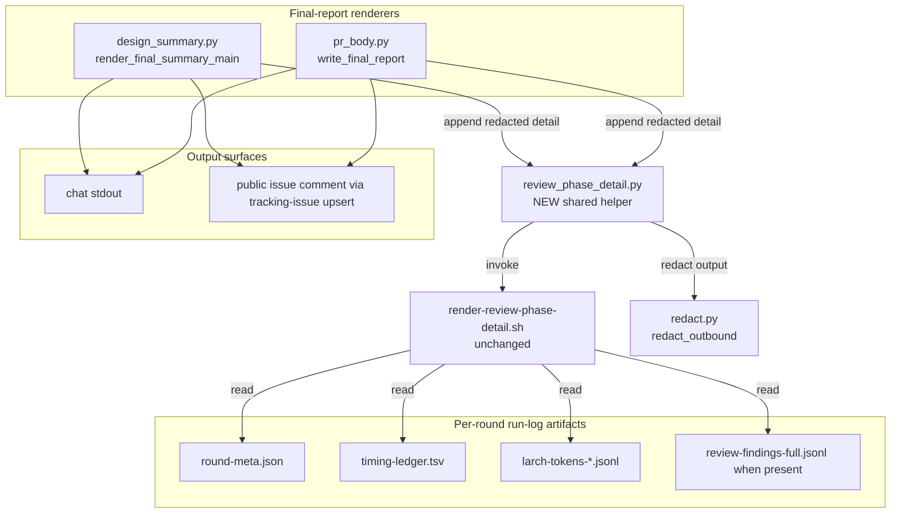

## Architecture Diagram

```mermaid
graph TD
    subgraph renderers["Final-report renderers"]
        DS["design_summary.py<br/>render_final_summary_main"]
        PB["pr_body.py<br/>write_final_report"]
    end

    RPD["review_phase_detail.py<br/>NEW shared helper"]
    SH["render-review-phase-detail.sh<br/>unchanged"]
    RED["redact.py<br/>redact_outbound"]

    subgraph inputs["Per-round run-log artifacts"]
        RM["round-meta.json"]
        TL["timing-ledger.tsv"]
        TOK["larch-tokens-*.jsonl"]
        FF["review-findings-full.jsonl when present"]
    end

    subgraph surfaces["Output surfaces"]
        CHAT["chat stdout"]
        COMMENT["public issue comment via tracking-issue upsert"]
    end

    DS -->|append redacted detail| RPD
    PB -->|append redacted detail| RPD
    RPD -->|invoke| SH
    RPD -->|redact output| RED
    SH -->|read| RM
    SH -->|read| TL
    SH -->|read| TOK
    SH -->|read| FF
    DS --> CHAT
    DS --> COMMENT
    PB --> CHAT
    PB --> COMMENT
```
