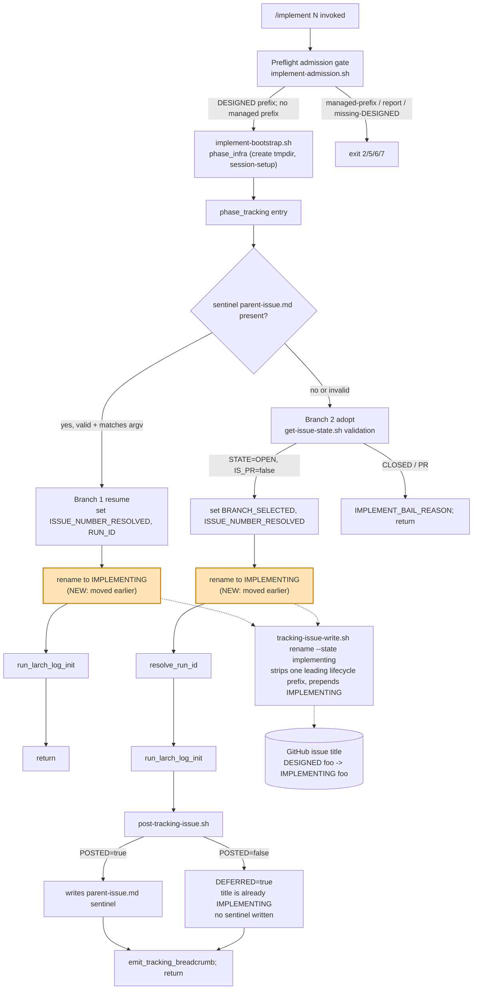

## Architecture Diagram

```mermaid
flowchart TD
    A["/implement N invoked"] --> B["Preflight admission gate<br/>implement-admission.sh"]
    B -->|"DESIGNED prefix; no managed prefix"| C["implement-bootstrap.sh<br/>phase_infra (create tmpdir, session-setup)"]
    B -->|"managed-prefix / report / missing-DESIGNED"| BX["exit 2/5/6/7"]
    C --> D["phase_tracking entry"]
    D --> D1{"sentinel parent-issue.md present?"}
    D1 -->|yes, valid + matches argv| E1["Branch 1 resume<br/>set ISSUE_NUMBER_RESOLVED, RUN_ID"]
    D1 -->|no or invalid| E2["Branch 2 adopt<br/>get-issue-state.sh validation"]
    E1 --> R1["rename to IMPLEMENTING<br/>(NEW: moved earlier)"]
    R1 --> L1["run_larch_log_init"]
    L1 --> END1["return"]
    E2 -->|STATE=OPEN, IS_PR=false| E2a["set BRANCH_SELECTED, ISSUE_NUMBER_RESOLVED"]
    E2 -->|CLOSED / PR| EX1["IMPLEMENT_BAIL_REASON; return"]
    E2a --> R2["rename to IMPLEMENTING<br/>(NEW: moved earlier)"]
    R2 --> RID["resolve_run_id"]
    RID --> L2["run_larch_log_init"]
    L2 --> PT["post-tracking-issue.sh"]
    PT -->|POSTED=true| WRITE["writes parent-issue.md sentinel"]
    PT -->|POSTED=false| DEF["DEFERRED=true<br/>title is already IMPLEMENTING<br/>no sentinel written"]
    WRITE --> END2["emit_tracking_breadcrumb; return"]
    DEF --> END2

    R1 -.-> TIW["tracking-issue-write.sh rename --state implementing<br/>strips one leading lifecycle prefix, prepends IMPLEMENTING"]
    R2 -.-> TIW
    TIW -.-> GH[("GitHub issue title<br/>DESIGNED foo -> IMPLEMENTING foo")]

    classDef changed fill:#ffe4b5,stroke:#cc7a00,stroke-width:2px;
    class R1,R2 changed;
```
