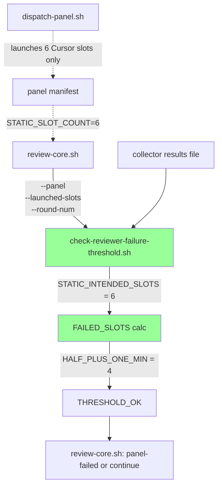

## Architecture Diagram

Before the fix, B used a round-aware `STATIC_INTENDED_SLOTS` (12 for HARD round-1, 7 for SIMPLE round-1, 6 otherwise) that did not match the post-#2449 launcher manifest of always 6 Cursor slots. After the fix, B uses a flat 6 in all cases so `NEVER_LAUNCHED = INTENDED − LAUNCHED` no longer adds phantom failures.
