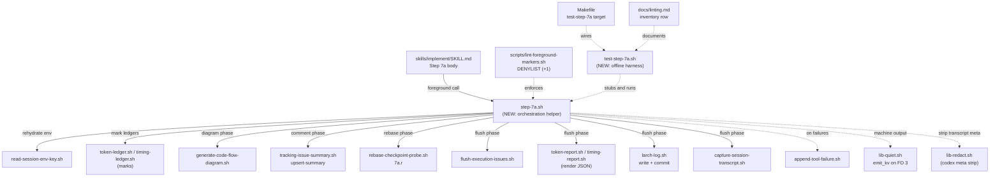

## Architecture Diagram

```mermaid
flowchart TD
    SKILL["skills/implement/SKILL.md<br/>Step 7a body"]
    STEP7A["step-7a.sh<br/>(NEW: orchestration helper)"]
    TEST["test-step-7a.sh<br/>(NEW: offline harness)"]

    REHYD["read-session-env-key.sh"]
    TOKMARK["token-ledger.sh / timing-ledger.sh<br/>(marks)"]
    GEN["generate-code-flow-diagram.sh"]
    SUMC["tracking-issue-summary.sh<br/>upsert-summary"]
    REBASE["rebase-checkpoint-probe.sh<br/>7a.r"]
    FLUSH["flush-execution-issues.sh"]
    CAPTURE["capture-session-transcript.sh"]
    REPORT["token-report.sh / timing-report.sh<br/>(render JSON)"]
    LARCHLOG["larch-log.sh<br/>write + commit"]

    LIBQUIET["lib-quiet.sh<br/>emit_kv on FD 3"]
    LIBREDACT["lib-redact.sh<br/>(codex meta strip)"]
    APPEND["append-tool-failure.sh"]

    DENYLIST["scripts/lint-foreground-markers.sh<br/>DENYLIST (+1)"]
    MAKEFILE["Makefile<br/>test-step-7a target"]
    LINTDOC["docs/linting.md<br/>inventory row"]

    SKILL -->|foreground call| STEP7A
    DENYLIST -.->|enforces| STEP7A
    MAKEFILE -.->|wires| TEST
    TEST -.->|stubs and runs| STEP7A
    LINTDOC -.->|documents| TEST

    STEP7A -->|rehydrate env| REHYD
    STEP7A -->|mark ledgers| TOKMARK
    STEP7A -->|diagram phase| GEN
    STEP7A -->|comment phase| SUMC
    STEP7A -->|rebase phase| REBASE
    STEP7A -->|flush phase| FLUSH
    STEP7A -->|flush phase| REPORT
    STEP7A -->|flush phase| LARCHLOG
    STEP7A -->|flush phase| CAPTURE
    STEP7A -.->|on failures| APPEND

    STEP7A -.->|machine output| LIBQUIET
    STEP7A -.->|strip transcript meta| LIBREDACT
```
