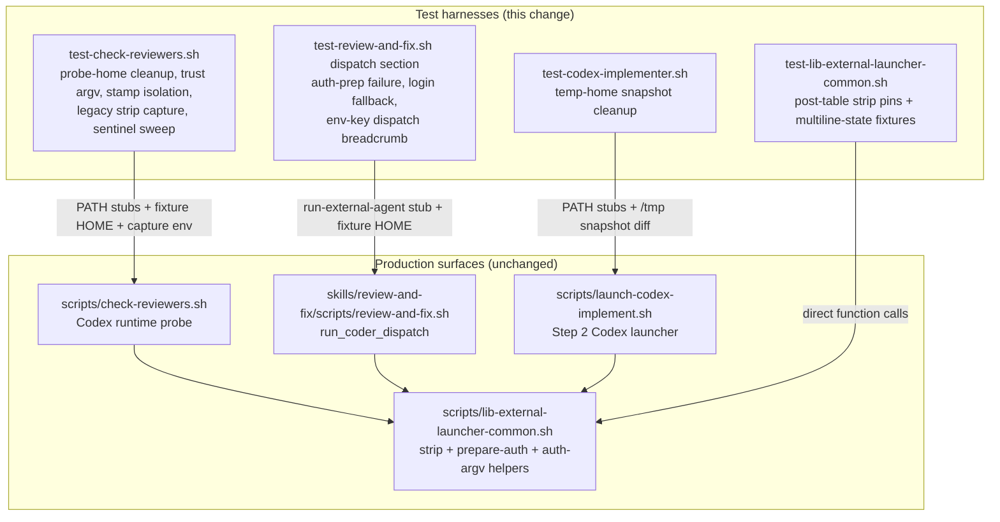

## Architecture Diagram

```mermaid
graph TD
    subgraph Production["Production surfaces (unchanged)"]
        LIB["scripts/lib-external-launcher-common.sh<br/>strip + prepare-auth + auth-argv helpers"]
        CR["scripts/check-reviewers.sh<br/>Codex runtime probe"]
        RAF["skills/review-and-fix/scripts/review-and-fix.sh<br/>run_coder_dispatch"]
        LCI["scripts/launch-codex-implement.sh<br/>Step 2 Codex launcher"]
    end

    subgraph Harnesses["Test harnesses (this change)"]
        TLIB["test-lib-external-launcher-common.sh<br/>post-table strip pins + multiline-state fixtures"]
        TCR["test-check-reviewers.sh<br/>probe-home cleanup, trust argv, stamp isolation,<br/>legacy strip capture, sentinel sweep"]
        TRAF["test-review-and-fix.sh dispatch section<br/>auth-prep failure, login fallback,<br/>env-key dispatch breadcrumb"]
        TLCI["test-codex-implementer.sh<br/>temp-home snapshot cleanup"]
    end

    CR --> LIB
    RAF --> LIB
    LCI --> LIB

    TLIB -- "direct function calls" --> LIB
    TCR -- "PATH stubs + fixture HOME + capture env" --> CR
    TRAF -- "run-external-agent stub + fixture HOME" --> RAF
    TLCI -- "PATH stubs + /tmp snapshot diff" --> LCI
```
