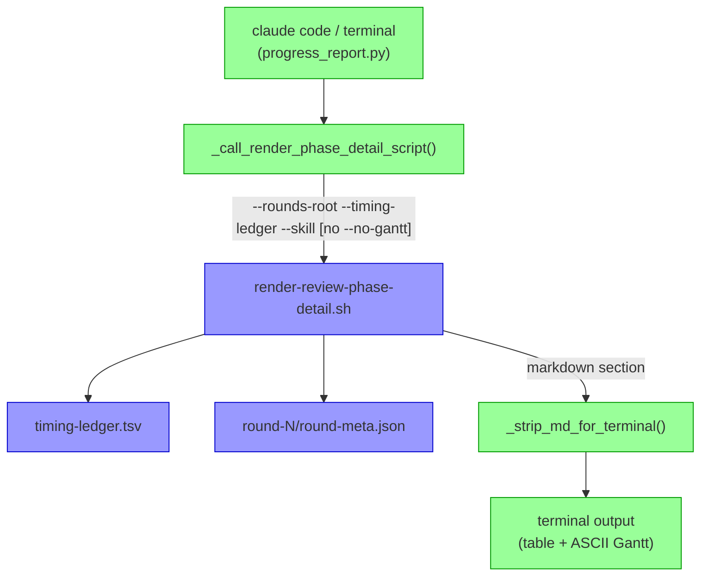

## Architecture Diagram

```mermaid
graph TD
    A["claude code / terminal<br/>(progress_report.py)"]
    B["_call_render_phase_detail_script()"]
    C["render-review-phase-detail.sh"]
    D["timing-ledger.tsv"]
    E["round-N/round-meta.json"]
    F["_strip_md_for_terminal()"]
    G["terminal output<br/>(table + ASCII Gantt)"]

    A --> B
    B -->|"--rounds-root --timing-ledger --skill [no --no-gantt]"| C
    C --> D
    C --> E
    C -->|"markdown section"| F
    F --> G

    classDef deleted fill:#f99,stroke:#c00
    classDef kept fill:#9f9,stroke:#090
    classDef shell fill:#99f,stroke:#00c

    class A,B,F,G kept
    class C,D,E shell
```
