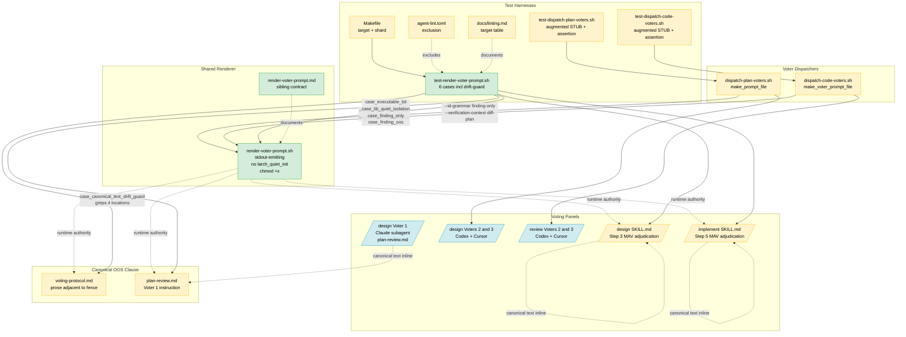

## Architecture Diagram

```mermaid
flowchart TD
    subgraph helper[Shared Renderer]
        H[render-voter-prompt.sh<br/>stdout-emitting<br/>no larch_quiet_init<br/>chmod +x]
        HM[render-voter-prompt.md<br/>sibling contract]
    end

    subgraph dispatchers[Voter Dispatchers]
        DPV[dispatch-plan-voters.sh<br/>make_prompt_file]
        DCV[dispatch-code-voters.sh<br/>make_voter_prompt_file]
    end

    subgraph voters[Voting Panels]
        V1[/design Voter 1<br/>Claude subagent<br/>plan-review.md/]
        V23P[/design Voters 2 and 3<br/>Codex + Cursor/]
        V23C[/review Voters 2 and 3<br/>Codex + Cursor/]
        MAV1[/design SKILL.md<br/>Step 3 MAV adjudication/]
        MAV2[/implement SKILL.md<br/>Step 5 MAV adjudication/]
    end

    subgraph canon[Canonical OOS Clause]
        VP[voting-protocol.md<br/>prose adjacent to fence]
        PR[plan-review.md<br/>Voter 1 instruction]
    end

    subgraph harness[Test Harnesses]
        TH[test-render-voter-prompt.sh<br/>6 cases incl drift-guard]
        TDP[test-dispatch-plan-voters.sh<br/>augmented STUB + assertion]
        TDC[test-dispatch-code-voters.sh<br/>augmented STUB + assertion]
        AL[agent-lint.toml<br/>exclusion]
        DL[docs/linting.md<br/>target table]
        MK[Makefile<br/>target + shard]
    end

    DPV -->|"--id-grammar finding-oos<br/>--verification-context plan"| H
    DCV -->|"--id-grammar finding-only<br/>--verification-context diff-plan"| H

    DPV --> V23P
    DCV --> V23C

    V1 -.canonical text inline.-> PR
    MAV1 -.canonical text inline.-> MAV1
    MAV2 -.canonical text inline.-> MAV2

    H -.runtime authority.-> VP
    H -.runtime authority.-> PR
    H -.runtime authority.-> MAV1
    H -.runtime authority.-> MAV2

    TH -->|case_canonical_text_drift_guard<br/>greps 4 locations| VP
    TH --> PR
    TH --> MAV1
    TH --> MAV2
    TH -->|case_executable_bit<br/>case_lib_quiet_isolation<br/>case_finding_only<br/>case_finding_oos| H

    TDP --> DPV
    TDC --> DCV

    MK --> TH
    AL -.excludes.-> TH
    DL -.documents.-> TH

    HM -.documents.-> H

    classDef new fill:#d4edda,stroke:#28a745,color:#000
    classDef modified fill:#fff3cd,stroke:#ffc107,color:#000
    classDef external fill:#d1ecf1,stroke:#17a2b8,color:#000
    class H,HM,TH new
    class DPV,DCV,TDP,TDC,VP,PR,MAV1,MAV2,AL,DL,MK modified
    class V1,V23P,V23C external
```
