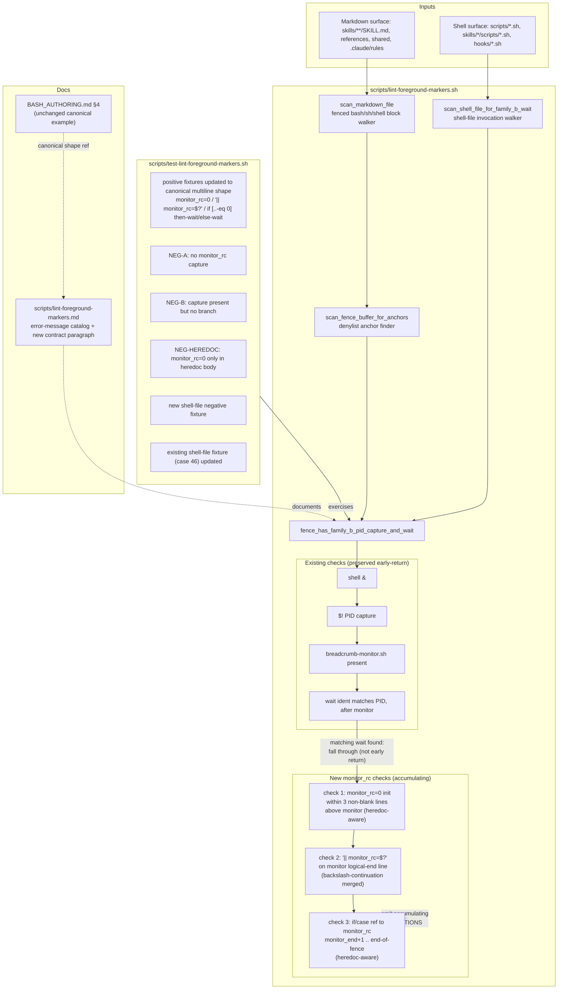

## Architecture Diagram

```mermaid
flowchart TD
    subgraph Inputs
        MD["Markdown surface: skills/**/SKILL.md, references, shared, .claude/rules"]
        SH["Shell surface: scripts/*.sh, skills/*/scripts/*.sh, hooks/*.sh"]
    end

    subgraph LintEntry["scripts/lint-foreground-markers.sh"]
        SCAN_MD["scan_markdown_file<br/>fenced bash/sh/shell block walker"]
        SCAN_FENCE["scan_fence_buffer_for_anchors<br/>denylist anchor finder"]
        SCAN_SH["scan_shell_file_for_family_b_wait<br/>shell-file invocation walker"]
        HELPER["fence_has_family_b_pid_capture_and_wait"]

        subgraph ExistingChecks["Existing checks (preserved early-return)"]
            AMP["shell &amp;"]
            PID["$! PID capture"]
            MON["breadcrumb-monitor.sh present"]
            WAIT["wait ident matches PID, after monitor"]
        end

        subgraph NewChecks["New monitor_rc checks (accumulating)"]
            NEW1["check 1: monitor_rc=0 init<br/>within 3 non-blank lines<br/>above monitor (heredoc-aware)"]
            NEW2["check 2: '|| monitor_rc=$?'<br/>on monitor logical-end line<br/>(backslash-continuation merged)"]
            NEW3["check 3: if/case ref to monitor_rc<br/>monitor_end+1 .. end-of-fence<br/>(heredoc-aware)"]
        end
    end

    subgraph TestHarness["scripts/test-lint-foreground-markers.sh"]
        POS["positive fixtures updated to canonical multiline shape<br/>monitor_rc=0 / '|| monitor_rc=$?' / if [..-eq 0] then-wait/else-wait"]
        NEGA["NEG-A: no monitor_rc capture"]
        NEGB["NEG-B: capture present but no branch"]
        NEGHD["NEG-HEREDOC: monitor_rc=0 only in heredoc body"]
        SHELLNEG["new shell-file negative fixture"]
        SHELLPOS["existing shell-file fixture (case 46) updated"]
    end

    subgraph Docs
        LFMM["scripts/lint-foreground-markers.md<br/>error-message catalog + new contract paragraph"]
        BASHAUTH["BASH_AUTHORING.md §4<br/>(unchanged canonical example)"]
    end

    MD --> SCAN_MD
    SCAN_MD --> SCAN_FENCE
    SCAN_FENCE --> HELPER
    SH --> SCAN_SH
    SCAN_SH --> HELPER
    HELPER --> AMP
    AMP --> PID
    PID --> MON
    MON --> WAIT
    WAIT -->|"matching wait found:<br/>fall through (not early return)"| NEW1
    NEW1 --> NEW2
    NEW2 --> NEW3
    NEW3 -->|"emit accumulating<br/>VIOLATIONS"| LintEntry

    TestHarness -->|"exercises"| HELPER
    LFMM -.->|"documents"| HELPER
    BASHAUTH -.->|"canonical shape ref"| LFMM
```
