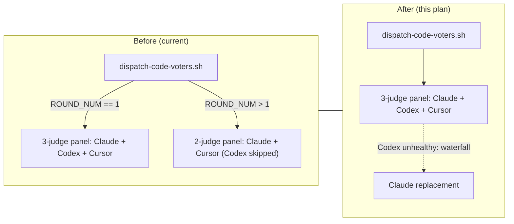

## Architecture Diagram

```mermaid
flowchart LR
    subgraph Before["Before (current)"]
        direction TB
        D1[dispatch-code-voters.sh] -- "ROUND_NUM == 1" --> P1["3-judge panel: Claude + Codex + Cursor"]
        D1 -- "ROUND_NUM &gt; 1" --> P2["2-judge panel: Claude + Cursor (Codex skipped)"]
    end

    subgraph After["After (this plan)"]
        direction TB
        D2[dispatch-code-voters.sh] --> P3["3-judge panel: Claude + Codex + Cursor"]
        P3 -. "Codex unhealthy: waterfall" .-> P4["Claude replacement"]
    end

    Before --- After
```
