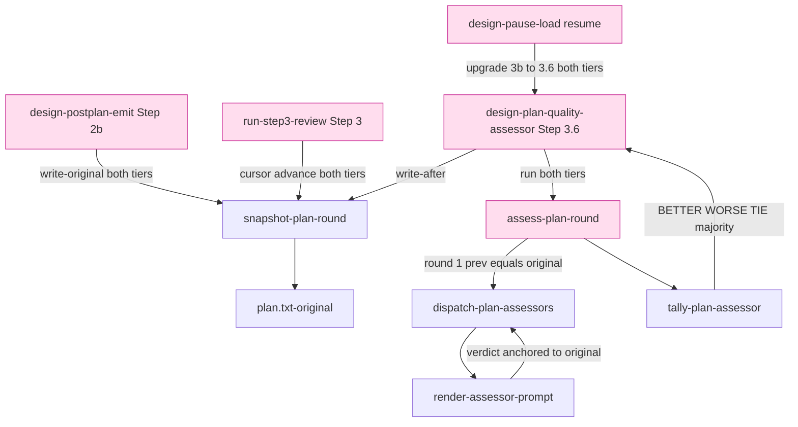

## Architecture Diagram

```mermaid
graph TD
  ORIG[plan.txt-original]
  SPR[snapshot-plan-round]

  PPE[design-postplan-emit Step 2b]
  RS3[run-step3-review Step 3]
  PL[design-pause-load resume]
  DPQA[design-plan-quality-assessor Step 3.6]
  APR[assess-plan-round]
  DPA[dispatch-plan-assessors]
  RAP[render-assessor-prompt]
  TPA[tally-plan-assessor]

  PPE -->|write-original both tiers| SPR
  SPR --> ORIG
  RS3 -->|cursor advance both tiers| SPR
  PL -->|upgrade 3b to 3.6 both tiers| DPQA
  DPQA -->|write-after| SPR
  DPQA -->|run both tiers| APR
  APR -->|round 1 prev equals original| DPA
  DPA --> RAP
  RAP -->|verdict anchored to original| DPA
  APR --> TPA
  TPA -->|BETTER WORSE TIE majority| DPQA

  classDef gate fill:#fde,stroke:#c39
  class PPE,RS3,PL,DPQA,APR gate
```

Pink nodes are the former HARD-only gates now opened to both tiers. All comparison paths anchor to `plan.txt-original`.
