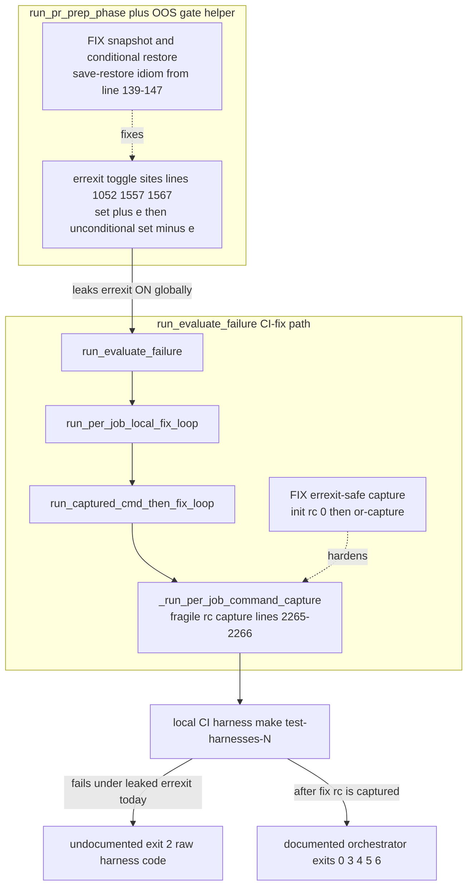

## Architecture Diagram

```mermaid
graph TD
    subgraph PRPREP["run_pr_prep_phase plus OOS gate helper"]
        T1["errexit toggle sites lines 1052 1557 1567<br/>set plus e then unconditional set minus e"]
        FIX1["FIX snapshot and conditional restore<br/>save-restore idiom from line 139-147"]
    end
    subgraph CIFIX["run_evaluate_failure CI-fix path"]
        EVAL["run_evaluate_failure"]
        LOOP["run_per_job_local_fix_loop"]
        RCC["run_captured_cmd_then_fix_loop"]
        CAP["_run_per_job_command_capture<br/>fragile rc capture lines 2265-2266"]
        FIX2["FIX errexit-safe capture<br/>init rc 0 then or-capture"]
    end
    HARN["local CI harness make test-harnesses-N"]
    DOC["documented orchestrator exits 0 3 4 5 6"]
    BUG["undocumented exit 2 raw harness code"]

    T1 -->|"leaks errexit ON globally"| EVAL
    EVAL --> LOOP
    LOOP --> RCC
    RCC --> CAP
    CAP --> HARN
    HARN -->|"fails under leaked errexit today"| BUG
    HARN -->|"after fix rc is captured"| DOC
    FIX1 -.fixes.-> T1
    FIX2 -.hardens.-> CAP
```
