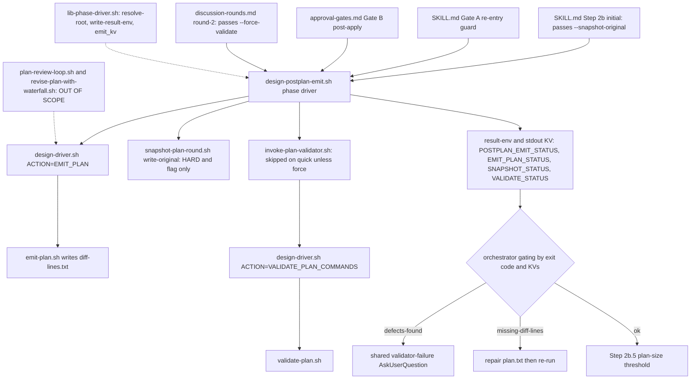

## Architecture Diagram

```mermaid
graph TD
    S2B["SKILL.md Step 2b initial: passes --snapshot-original"]
    GA["SKILL.md Gate A re-entry guard"]
    GB["approval-gates.md Gate B post-apply"]
    DR["discussion-rounds.md round-2: passes --force-validate"]

    LIB["lib-phase-driver.sh: resolve-root, write-result-env, emit_kv"]
    DRV["design-postplan-emit.sh phase driver"]

    S2B --> DRV
    GA --> DRV
    GB --> DRV
    DR --> DRV
    LIB -.-> DRV

    DRV --> EMIT["design-driver.sh ACTION=EMIT_PLAN"]
    EMIT --> EP["emit-plan.sh writes diff-lines.txt"]
    DRV --> SNAP["snapshot-plan-round.sh write-original: HARD and flag only"]
    DRV --> VAL["invoke-plan-validator.sh: skipped on quick unless force"]
    VAL --> VD["design-driver.sh ACTION=VALIDATE_PLAN_COMMANDS"]
    VD --> VP["validate-plan.sh"]

    DRV --> OUT["result-env and stdout KV: POSTPLAN_EMIT_STATUS, EMIT_PLAN_STATUS, SNAPSHOT_STATUS, VALIDATE_STATUS"]
    OUT --> GATE{"orchestrator gating by exit code and KVs"}
    GATE -->|defects-found| ASK["shared validator-failure AskUserQuestion"]
    GATE -->|missing-diff-lines| REPAIR["repair plan.txt then re-run"]
    GATE -->|ok| S25["Step 2b.5 plan-size threshold"]

    OOS["plan-review-loop.sh and revise-plan-with-waterfall.sh: OUT OF SCOPE"] -.-> EMIT
```
