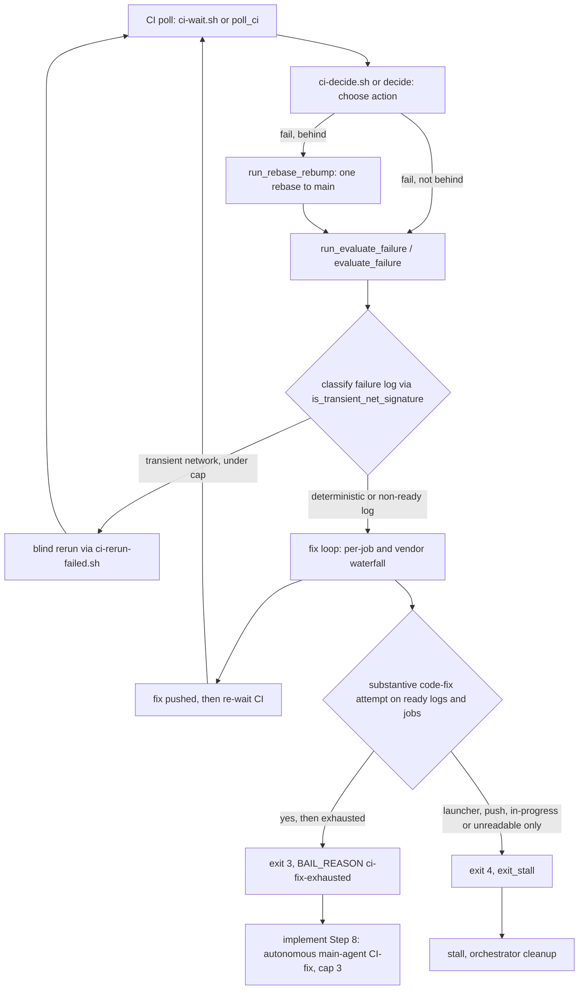

## Architecture Diagram

```mermaid
flowchart TD
    A["CI poll: ci-wait.sh or poll_ci"] --> B["ci-decide.sh or decide: choose action"]
    B -->|"fail, not behind"| C["run_evaluate_failure / evaluate_failure"]
    B -->|"fail, behind"| R["run_rebase_rebump: one rebase to main"]
    R --> C
    C --> G{"classify failure log via is_transient_net_signature"}
    G -->|"transient network, under cap"| RR["blind rerun via ci-rerun-failed.sh"]
    G -->|"deterministic or non-ready log"| F["fix loop: per-job and vendor waterfall"]
    RR --> A
    F --> PUSH["fix pushed, then re-wait CI"]
    PUSH --> A
    F --> P{"substantive code-fix attempt on ready logs and jobs"}
    P -->|"yes, then exhausted"| X3["exit 3, BAIL_REASON ci-fix-exhausted"]
    P -->|"launcher, push, in-progress or unreadable only"| X4["exit 4, exit_stall"]
    X3 --> O["implement Step 8: autonomous main-agent CI-fix, cap 3"]
    X4 --> S["stall, orchestrator cleanup"]
```
