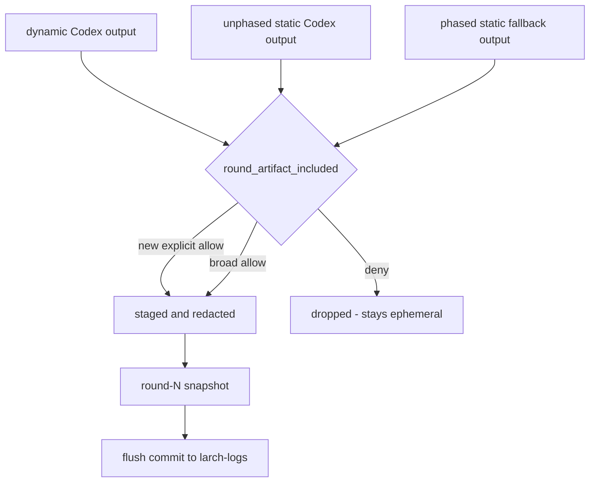

## Architecture Diagram

```mermaid
graph TD
    DYN[dynamic Codex output] --> FILTER{round_artifact_included}
    STAT[unphased static Codex output] --> FILTER
    PHASE[phased static fallback output] --> FILTER
    FILTER -->|new explicit allow| INC[staged and redacted]
    FILTER -->|deny| DROP[dropped - stays ephemeral]
    FILTER -->|broad allow| INC
    INC --> ROUND[round-N snapshot]
    ROUND --> FLUSH[flush commit to larch-logs]
```
